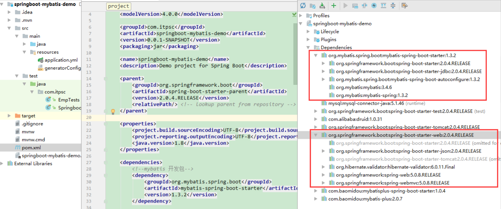
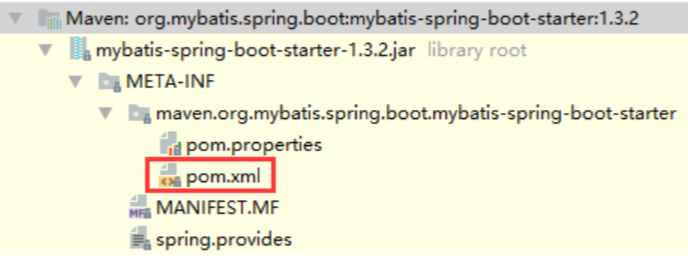
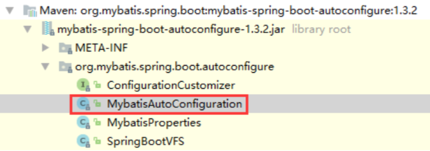
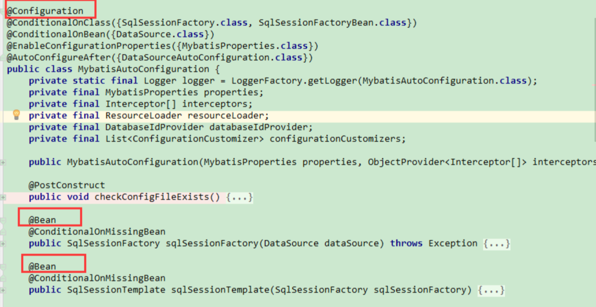
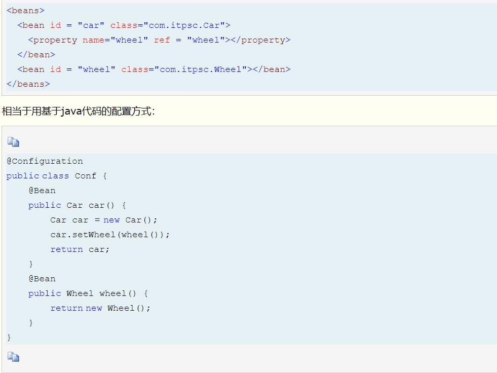
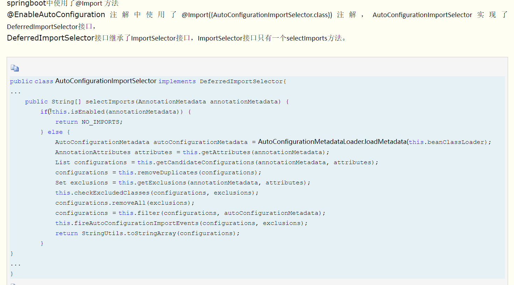

### springboot 启动机制
springboot是通过默认配置了很多框架的使用方式简化了项目搭建以及开发流程。

**没有springboot情况下**  
1. pom引入相关jar包，包括spring、springmvc、redis、log4j等相关jar。
2. 配置web.xml,Listener配置，Filter配置，Servlet配置，log4j配置
3. 配置数据库连接、配置spring事务
4. 配置试图解析器
5. 开启注解、自动扫描功能
6. 配置完成后部署tomcat、启动调试

**有springboot情况下**
1. 引入jar，比如mybatis开发包、springboot的web-starter；spring-boot-starter-web包会自动引入web模块开发需要的相关jar包。spring-boot-starter-xxx是官方提供的starter；xxx-spring-boot-starter是第三方提供的starter。  
  
mybatis-spring-boot-starter中没有源码，只有一个pom文件，作用就是引入相关的jar包  
  
2. 配置数据源  

starter机制完成了项目起步所需要的相关jar包，但是传统的很多bean，比如datasource的配置，transactionManager的配置，springboot是如何完成这些bean的配置的?  

**自动配置**
例如Mybatis，在mybatis-spring-boot-starter包中引入了mybatis-spring-boot-autoconfigure这个包  
  
  
使用@Configuration和@Bean组合，可以创建一个基于java代码的配置类,可以用来替代相应的xml配置文件。@Configuration注解的类可以看做是能生产让spring ioc容器管理的bean实例工厂。 @Bean注解告诉spring，一个带有@Bean注解方法将返回一个对象，该对象应该被注册到spring容器里。  
  
但是要完成自动配置是有依赖条件的  
1. @ConditionalOnBean,仅在当前上下文中存在某个bean时，才会实例化这个bean
2. @ConditionalOnClass,某个class位于类路径上，才会实例化这个bean
3. @ConditionalOnExpression,当表达式为true，才会实例化这个bean
4. @ConditionalOnMissingBean,当前上下文不存在某个bean时，才会实例化这个bean
5. @ConditionalOnMissingClass,某个class不在类路径上，才会实例化这个bean
6. @ConditionalOnNotWebApplication,不是web应用时才会实例这个bean
7. @AutoConfigureAfter,在某个bean完成自动配置后实例化这个bean
8. @AutoConfigureBefore,某个bean完成自动配置前实例化这个bean
9. @ConditionalOnSingleCandidate,当存在唯一确定的bean，才会实例化

**Bean参数获取**
spring是如何读取yml或者properties配置文件的属性来创建数据源？  
主要是两个注解@ConfigurationProperties和@EnableConfigurationProperties  
@ConfigurationProperties作用是把yml或者properties配置文件转化成bean  
@EnableConfigurationProperties是使@ConfigurationProperties注解生效,如果只配置了@ConfigurationProperties注解，在spring容器中是获取不到yml或者properties配置文件转化的bean的.  

**Bean发现**
springboot默认扫描启动类所在包下的主类与子类的所有组件,没有包括依赖包中的类，这些类是怎么发现的？  
@SpringBootApplication注解中有三个重要的注解：  
1. @Configuration：被注解的类将成为一个bean配置类
2. @EnableAutoConfiguration：借助@Import的支持，搜集和注册依赖包中相关的bean定义
3. @ComponentScan：自动扫描并加载符合条件的组件，比如@Component和@Repository等

@EnableAutoConfiguration包含两个注解
1. @AutoConfigurationPackage: 里面包含@Import注解，自动将加载启动类所在的包下的主类和子类的所有组件注册到spring容器中
2. @Import:这里import了AutoConfigurationImportSelector类，这个类就是加载所有jar包下META-INF/spring.factories文件中的类，这个文件中，每个xxxAutoConfiguration都是一个基于java的bean配置类，这些xxxAutoConfiguration并不是都会加载，会根据上面的@ConditionalOnClass等条件进行判断.  

**bean加载**
让一个普通类被spring容器管理，通常有三个方法
1. 使用@Configuration和@Bean注解
2. 使用@Controller @Service @Component注解标记，然后启用@ComponentScan扫描
3. 使用@Import方法

springboot中使用了@Import方法  
  
