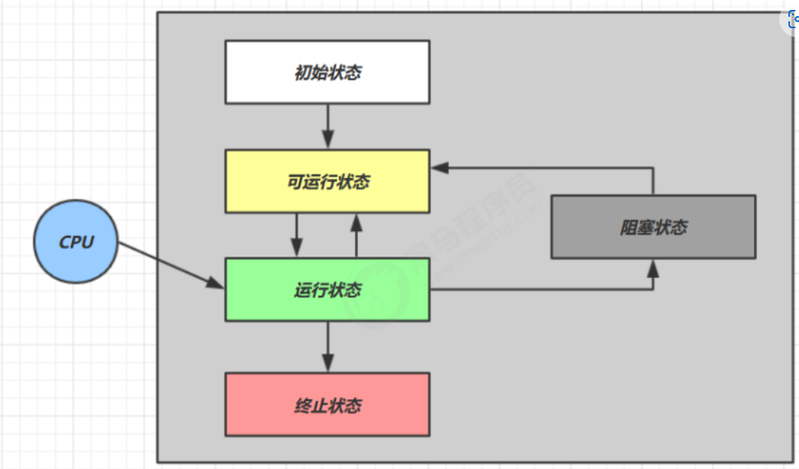
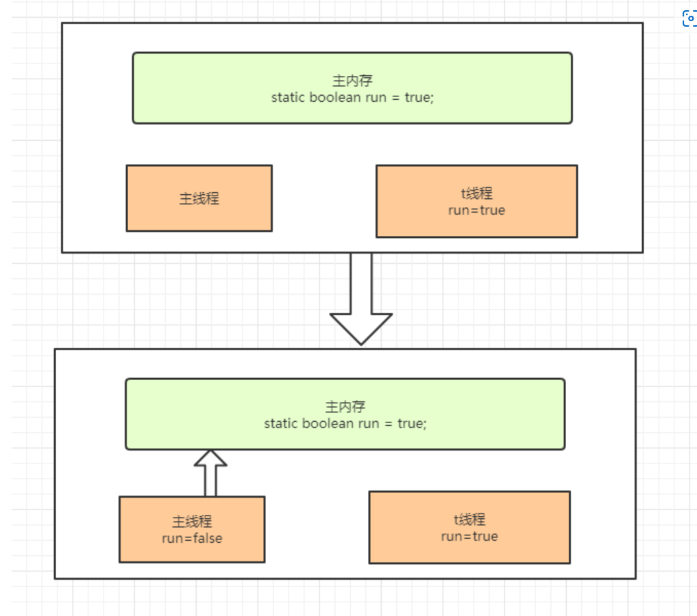

### 多线程难点
1. 多线程的执行结果不确定，受到cpu调度的影响
2. 多线程的安全问题
3. 线程资源宝贵，依赖线程池操作线程，线程池的参数设置问题
4. 多线程执行是动态的，同时的，难以追踪过程
5. 多线程的底层是操作系统层面的，源码难度大

#### 定义任务、创建和运行线程
定义任务：
1. 继承Thread类(将任务和线程合并在一起)
2. 实现Runnable接口(将任务和线程分开了)
3. 实现Callable接口(利用FutureTask执行任务)

Thread实现任务的局限性：
1. 任务逻辑写在Thread类的run方法中，有单继承的局限性
2. 创建多线程时，每个任务有成员变量时不共享，必须加static才能做到共享

Runnable相比Callable的局限性：
1. 任务没有返回值
2. 任务无法抛异常给调用方


#### 线程的阻塞
操作系统层面和java层面阻塞的定义可能不同,但是广义上使得线程阻塞的方式有下面几种：
1. BIO阻塞，使用了阻塞的io流
2. sleep让线程休眠进入阻塞状态
3. a.join调用该方法的线程进入阻塞，等待a线程执行完恢复运行
4. synchronized或者ReentrantLock造成线程未获得锁进入阻塞状态
5. 获得锁后调用wait方法，也会让线程进入阻塞状态
6. LockSupport.park让线程进入阻塞状态

#### 线程的打断
1. interrupt():中断线程， 可以打断sleep/wait/join等显式抛出InterruptedException方法的线程，但是打断后，线程的打断标记还是false。 如果是打断正常线程，线程不会真正被中断,但是线程的打断标记为true.
2. isInterrupted():获取线程的打断标记，调用后不会修改线程的打断标记.
3. interrupted():获取线程的打断标记，调用后清空打断标记，如果获取结果为true,调用后打断标记为false(不常用)
```java
public static void test2() {
        Thread t = new Thread(() -> {
            while (true) {
                Thread thread = Thread.currentThread();
                if (thread.isInterrupted()) {
                    System.out.println("当前线程被打断,结束运行");
                    break;
                }
                //正常没被打断
                try {
                    TimeUnit.SECONDS.sleep(5);
                    System.out.println("没被打断");
                } catch (InterruptedException e) {
                    //被别人打断了,但是由于是sleep方法,所以打断标记还是false
                    System.out.println("3   " + thread.isInterrupted());
                    //会改变打断标记
                    thread.interrupt();
                    System.out.println("4  " + thread.isInterrupted());
                }
            }
        });
        t.start();
        try {
            TimeUnit.SECONDS.sleep(3);
            t.interrupt();
        } catch (InterruptedException e) {
            e.printStackTrace();
        }
    }
```

### 线程状态
从操作系统层面有五个状态，java api层面有六个状态
  
初始状态：创建线程对象时的状态
可运行状态(就绪状态)：调用start()方法后进入就绪状态，也就是准备好被cpu调度执行
运行状态：线程获取到cpu的时间片，执行run()方法的逻辑
阻塞状态: 线程被阻塞，放弃cpu的时间片，等待解除阻塞重新回到就绪状态争抢时间片
终止状态: 线程执行完成或抛出异常后的状态

从java api层面
  
blocked和waitting的区别：
线程可以通过wait、join、LockSupport.park方式进入waitting状态，进入waitting状态的线程等待唤醒(notify、notifyAll)才有机会获取cpu时间片来继续执行。  
线程的blocked状态是无法进入同步方法/代码块来完成的，这是因为无法获取到与同步方法相关联的锁。  
与waitting状态相关联的是等待队列，与blocked状态相关的是同步队列

### 同步锁
线程安全：
1. 一个线程运行多个线程本身是没有问题的
2. 问题有可能出现多个线程访问共享资源， 当多个下次线程都是读共享资源也是没问题；当多个线程读写共享资源，如果发生指令交错，就会出现问题。  

临界区：当两个线程竞争同一资源时，如果对资源的访问顺序敏感，就称存在竞态条件。导致竞态条件发生的代码区称作临界区，就是线程不同步导致问题的代码区

指令交错：java代码解析成字节码文件时，java代码的一行代码在字节码中可能有多行，在线程上下文切换时就有可能报错。

线程安全的类并不是所有操作都线程安全，它是每个独立的方法是线程安全的，但是方法的组合就不一定是线程安全的。
```java
// 例如Vector类，每个方法都是线程安全的,但是如果我们这样做
public Object deleteLast(Vector v){
    int lastIndex = v.size() - 1;
    v.remove(lastIndex);
}
如果是多线程调用此方法,A线程还没执行到remove时，B线程也获取到了Vecotr的最后一位index，这时候B线程执行remove时，A线程执行完了remove，那B线程remove时就会超过数组的长度了,数组越界。
```

成员变量、静态变量、局部变量是否线程安全：
成员变量、静态变量：如果没有多线程共享，安全；多线程共享但是是读操作，安全；存在写操作，写的代码又是临界区，不安全。
局部变量：线程安全的，但是局部变量引用的对象未必是安全的

#### synchronized
同步锁，对象锁，是锁在对象上的，用于保证线程安全，是阻塞式的解决方案。
不是一个线程加了锁，进入synchronized代码块就会一直执行下去，如果时间片切换了，也会执行其他线程，再切换回来会接着执行，只是不会执行到有竞争锁的资源，因为当前线程还未释放锁；当一个线程执行完synchronized代码块后，会唤醒正在等待的线程。

#### wait+notify
线程间通信可以通过共享变量+wait&notify来实现，wait将线程进入阻塞状态，notify将线程唤醒
  
1. Thread-0先获取到对象的锁，关联到monitor的owner，同步代码块内调用了锁对象的wait()方法，调用后会进入waitSet等待，Thread-1同样如此，此时Thread-0的状态为Waitting
2. Thread2、3、4、5同时竞争，2获取到锁后，关联了monitor的owner，3、4、5只能进入EntryList中等待，此时2线程状态为 Runnable，3、4、5状态为Blocked
3. 2执行后，唤醒entryList中的线程，3、4、5进行竞争锁，获取到的线程即会关联monitor的owner
4. 3、4、5线程在执行过程中，调用了锁对象的notify()或notifyAll()时，会唤醒waitSet的线程，唤醒的线程进入entryList等待重新竞争锁

wait() 释放锁 进入 waitSet 可传入时间，如果指定时间内未被唤醒 则自动唤醒
notify()随机唤醒一个waitSet里的线程
notifyAll()唤醒waitSet中所有的线程

#### wait和sleep的区别?
1. wait是Object的方法，sleep是Thread下的方法
2. wait会立即释放锁，sleep不会释放锁
3. wait后线程的状态是waitting，sleep后线程状态是Time_waitting
   
#### park&unpark
LockSupport是juc下的工具类，提供park和unpark方法，实现线程通信。
与wait和notify相比的不同点：
1. wait和notify需要获取对象锁，park unpark不需要
2. unpark可以指定唤醒线程，notify随机唤醒
3. park和unpark的顺序可以先unpark，wait和notify的顺序不能颠倒
   
#### 死锁
```java
public void test2() throws InterruptedException {
        new Thread(() -> {
            synchronized (object1) {
                System.out.println("t1获取到了1，准备获取2");
                try {
                    TimeUnit.SECONDS.sleep(4);
                } catch (InterruptedException e) {
                    e.printStackTrace();
                }
                synchronized (object2) {
                    System.out.println("t1获取到了2");
                }
            }
        }).start();
        new Thread(() -> {
            synchronized (object2) {
                System.out.println("t2获取到了2，准备获取1");
                try {
                    TimeUnit.SECONDS.sleep(4);
                } catch (InterruptedException e) {
                    e.printStackTrace();
                }
                synchronized (object1) {
                    System.out.println("t2获取到了1");
                }
            }
        }).start();
    }
```
检测方式：
1. 先用jps -l 查看对应的java进程编号
2. jstack 进程编号   查看进程的分析信息


### JMM java内存模型
1. 原子性：保证指令不会受到上下文切换的影响
2. 可见性：保证指令不会受到cpu缓存的影响
3. 有序性：保证指令不会受到并行优化的影响

可见性：
  
有序性：
jvm在不影响程序正确性的情况下可能会调整语句的执行顺序，叫做指令重排序

**volatile**
解决了可见性和有序性，volatile通过内存屏障来实现的。
1. 写屏障：会在对象写操作后加写屏障，会对写屏障之前的数据都同步到主存
2. 读屏障：会在对象读操作前加读屏障，