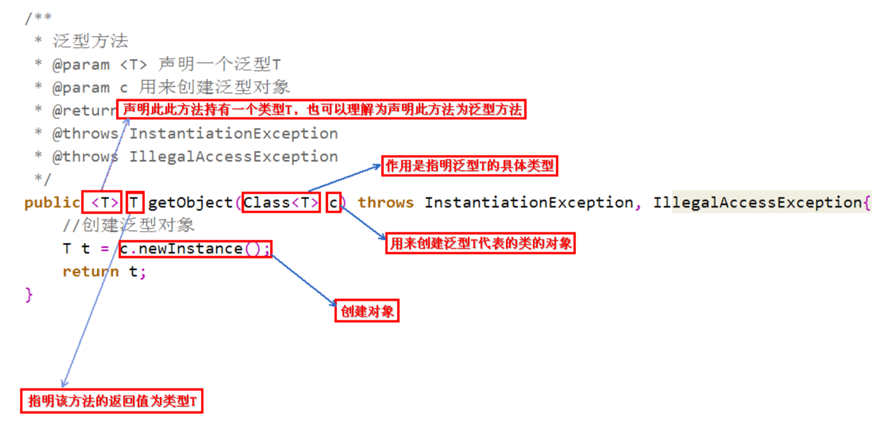

### 为啥会有泛型
没有泛型的情况下，比如集合，我们往集合里存不同类型的元素，都是可以的，在编译阶段，是能通过的，但是如果我们代码中有取元素并强转的代码，在运行阶段就会报错，ClassCastException，泛型的出现就是为了在编译阶段解决这个问题了,所以泛型只在编译阶段有效. 泛型类型在逻辑上可以看成多个不同的类型，实际上都是相同的类型。

### 泛型类
是在实例化类的时候指明泛型的具体类型
```java
class Point<T>{         // 此处可以随便写标识符号，T是type的简称  
    private T var ;     // var的类型由T指定，即：由外部指定  
    public T getVar(){  // 返回值的类型由外部决定  
        return var ;  
    }  
    public void setVar(T var){  // 设置的类型也由外部决定  
        this.var = var ;  
    }  
}  
public class GenericsDemo06{  
    public static void main(String args[]){  
        Point<String> p = new Point<String>() ;     // 里面的var类型为String类型  
        p.setVar("it") ;                            // 设置字符串  
        System.out.println(p.getVar().length()) ;   // 取得字符串的长度  
    }  
}

```
静态方法与泛型，静态方法无法访问类定义上的泛型，如果静态方法操作的引用数据类型不确定，必须要将泛型定义在方法上。

### 泛型接口
```java
interface Info<T>{        // 在接口上定义泛型  
    public T getVar() ; // 定义抽象方法，抽象方法的返回值就是泛型类型  
}  
class InfoImpl<T> implements Info<T>{   // 定义泛型接口的子类  
    private T var ;             // 定义属性  
    public InfoImpl(T var){     // 通过构造方法设置属性内容  
        this.setVar(var) ;    
    }  
    public void setVar(T var){  
        this.var = var ;  
    }  
    public T getVar(){  
        return this.var ;  
    }  
} 
public class GenericsDemo24{  
    public static void main(String arsg[]){  
        Info<String> i = null;        // 声明接口对象  
        i = new InfoImpl<String>("汤姆") ;  // 通过子类实例化对象  
        System.out.println("内容：" + i.getVar()) ;  
    }  
}  
```

### 泛型方法
调用方法的时候指明泛型的具体类型。
  

为啥有泛型方法：因为泛型类在实例化时就指明了类型，如果想换一种类型，不得不重新new一次，就不太灵活，二泛型方法可以再调用的时候指明类型，更加灵活。

#### 泛型的上下限
```java
class A{}
class B extends A {}

// 如下两个方法不会报错
public static void funA(A a) {
    // ...          
}
public static void funB(B b) {
    funA(b);
    // ...             
}

// 如下funD方法会报错
public static void funC(List<A> listA) {
    // ...          
}
public static void funD(List<B> listB) {
    funC(listB); // Unresolved compilation problem: The method doPrint(List<A>) in the type test is not applicable for the arguments (List<B>)
    // ...             
}
```
同一种泛型可以对应多个版本,不同版本的泛型类实例是不兼容的.  

类型通配符?  
```java
public void test(Test<?> obj){
    Log.d("泛型测试","key value is "+obj.getKey());
}
类型通配符一般是是用?代替具体的类型实参, ?是类型实参，不是类型形参,此处的?和Number、String、Integer一样都是一种实际的类型,当操作类型时，不需要使用类型的具体功能，只使用Object类中的功能，那么可以用?通配符来表未知类型。
```


为了解决泛型中隐含的转换问题，加入了类型参数的上下边界机制,<? extends A> 表示该类型的参数可以使A(上边界)或者A的子类型，编译时擦除到类型A，即用A类型代替类型参数，编译器知道类型参数的范围，如果传入的实例类型B是在这个范围内的话允许转换，运行时会把对象当做A的实例看待  
```java
public static void funC(List<? extends A> listA) {
    // ...          
}
public static void funD(List<B> listB) {
    funC(listB); // OK
    // ...             
}

```
#### 泛型上下限的引入
可以为传入的泛型类型实参进行上下边界的限制，如：类型实参只准传入某种类型的父类或某种类型的子类  

上限：
```java
class Info<T extends Number>{    // 此处泛型只能是数字类型
    private T var ;        // 定义泛型变量
    public void setVar(T var){
        this.var = var ;
    }
    public T getVar(){
        return this.var ;
    }
    public String toString(){    // 直接打印
        return this.var.toString() ;
    }
}
public class demo1{
    public static void main(String args[]){
        Info<Integer> i1 = new Info<Integer>() ;        // 声明Integer的泛型对象
    }
}

```

下限：
```java
class Info<T>{
    private T var ;        // 定义泛型变量
    public void setVar(T var){
        this.var = var ;
    }
    public T getVar(){
        return this.var ;
    }
    public String toString(){    // 直接打印
        return this.var.toString() ;
    }
}
public class GenericsDemo21{
    public static void main(String args[]){
        Info<String> i1 = new Info<String>() ;        // 声明String的泛型对象
        Info<Object> i2 = new Info<Object>() ;        // 声明Object的泛型对象
        i1.setVar("hello") ;
        i2.setVar(new Object()) ;
        fun(i1) ;
        fun(i2) ;
    }
    public static void fun(Info<? super String> temp){    // 只能接收String或Object类型的泛型，String类的父类只有Object类
        System.out.print(temp + ", ") ;
    }
}
```
上限<? extends T> 不能往里存,只能往外取(只能get)， 因为编译器只知道容器里是T或者T的子类，但是不知道具体的类型，所以存的时候，无法判断是否要存入的数据类型与容器中的类型一致，所以会拒绝set操作.  

下限<? super T> 往外取只能赋值给Object变量，不影响往里存，因为编译器知道它是T或者T的父类，这样就放松了限制，T的父类一直到Object类型的对象都可以往里存,但是取的时候，只能当成Object对象使用.


#### 泛型类型不能实例化
不能实例化泛型类型，本质上是由于类型擦除决定的
```java
T test = new T(); // ERROR

```
因为java编译期没法确定泛型参数化类型，找不到对应的类字节码文件，所以就不行,所以可以通过反射实现
```java
static <T> T newTclass (Class < T > clazz) throws InstantiationException, IllegalAccessException {
    T obj = clazz.newInstance();
    return obj;
}
```
