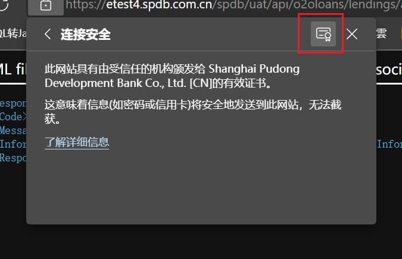

### PKIX path building failed
由于我们访问的是https,需要证书,所以我们要导入证书到jre中
1. 查看证书
 
 
 
选择base64进行保存
2. 将证书导入到jre中
```
进入到jre/lib/security中,执行命令
keytool -import -alias cmss -keystore cacerts -file D://cmss.cer
cmss 表示你证书的别名（推荐和你文件名保持一致）
输入密码changeit
然后选择信任证书,如果这时候报没权限,那是没有权限写入cacerts文件中.执行 sudo chmod 777 cacerts即可
```
3. 重新java项目