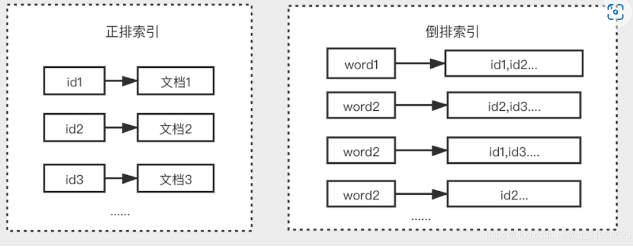
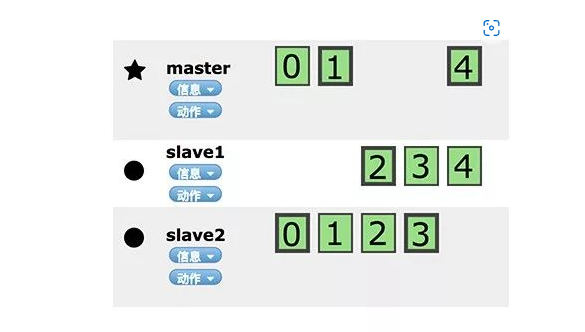

## elasticsearch

### 倒排索引
也叫反向索引,将文档内容中的单词作为索引,将包含该词的文档id作为记录
  

### 专有名词
索引 index: 存放数据的地方,相当于mysql中的一个数据库

类型 type: 定义数据结构的,相当于mysql中的一张表，但是新版es里一个索引对应一个类型，不能自定义类型了。里面有字段的类型是keyword和text,keyword类型是不会分词的,直接根据字符串内容建立反向索引,text类型会先分词

文档 document: 就是最终的数据,相当于一条数据记录

分片:可以理解为分表，创建索引时指定分片数量，每个分片本身也是个功能完善并且独立的索引，这个索引可以放到集群中的任何节点上。 分片可以扩展内容容量。

副本：假如某个分片/节点处于离线状态,则需要故障转移机制,es允许创建分片的一份或者多分拷贝,这些拷贝叫做复制分片,有一点很重要,复制分片不与 原/主要分片置于同一个节点上. 扩展了搜索量/吞吐量，因为搜索可以在所有的副本上并行运行。

### 分布式原理
  

可以发现，01234,某个节点挂了,其他节点其实还有备份。
节点是对等的,节点间会通过自己一些规则选取集群的master,master会负责集群状态信息的改变,并同步给其他节点
#### 节点扩容
首先当文档写入，这时候改索引有多个节点，会根据路由算法，存到对应的主分片上：shard=hash(routing)%number_of_primary_shards，routing可以是文档的id值，所以主分片数量，从索引创建好就不能修改的，因为如果改了，那么路由算法就不对了， 所以这儿有个问题，为啥不用一致性hash呢，动态新增分片了es把数据重新分配撒，原因是分片的切分成本和重新建立索引的成本差不多，所以官方干脆建议直接reindex。

#### 数据保存同步
创建、索引、删除文档都是写操作，这些操作必须在primary shard完全成功后才能拷贝至其对应的replicas上

#### 选举机制
在Discovery模块,负责发现集群中的节点,以及选择主节点,支持多种不同Discovery类型选择,内置实现ZenDiscovery.封装了节点发现(Ping)、选择master实现过程.

选举算法：
1. Bully算法：假设每个节点都有一个唯一的ID，使用该ID对节点进行排序,任何时候的当前master都是参与集群的最高ID节点.
优点：容易实现
缺点：如果master节点处于不稳定状态会有问题, 比如master负载过重而假死(停止响应),集群第二大ID节点被选择为新的master,这时原来的master恢复,再次被选择为新主,然后又假死。

ES通过推迟选举,直到当前的master失效再进行选举, 但是容易产生脑裂,所以再通过“法定得票人数过半” 解决脑裂问题。
脑裂：大脑分裂，原因是网络通信原因,其他节点无法与master节点通信,按照规则,所以会选举出一个新的master，所以会出现这样一种情况,在集群环境中部分节点能正常与master通信,另一部分不能,所以不能正常通信的节点会选举一个新的master节点，这个时候就脑裂了,有多个大脑。
解决方法：**减少误判**，ddiscovery.zen:ping_timeout节点状态的响应时间默认为3s，可以适当调大，就可以减少误判。
**选举触发**：discovery.zen:minimum_master_nodes:1 控制选举行为发生的最小集群主节点数量，建议设置为超过半数的备选节点同意，才能发生主节点重选.
**角色分离**：master节点与data节点分离，node.master和node.data不要同时设置为true，这样会减少master节点假死

2. Paxos算法：
缺点：实现复杂.

3. Raft算法：

#### 同步机制
建立索引和类型时经过master，master完成后将集群状态同步到slave。如果是单纯写入数据，有一个简单的routing规则，可以route到集群中任意节点，所以数据写入的压力是分散在整个集群的。

### 处理并发冲突
比如es中存储网上商品库存数量，如果时促销，那么一秒要卖好几个，如果我们的两个web程序并行运行，每一个都同时处理所有商品的销售，会造成库存结果不一致的情况。

解决方法：1. 乐观锁方法，es的文档中，有个version字段，version字段可以做乐观锁

### 查询
#### filter和query的区别
filter通常用于过滤文档的范围,比如某个字段是否属于某个类型,或者属于哪个时间区间.

query更倾向于更准确的查找，会计算出每份文档对于某次查询有多相关，然后分配文档一个相关性分数：_score
分数用来对匹配的文档进行相关性排序，十分适合全文搜索.

filter是精确查询，对文档的结果是 yes/no，所以可以对时间在某个范围、状态status字段是xx用filter，query对应文档检索是对文档相关性评分   所以其实性能上filter要比query快。

如何选择： 如果是全文检索、评分排序，用query。  如果是是非过滤，精确匹配，用filter

