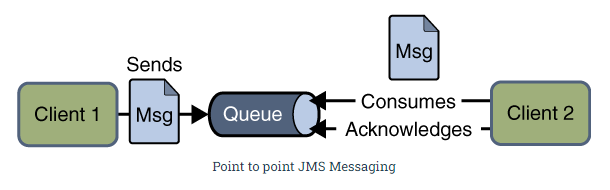
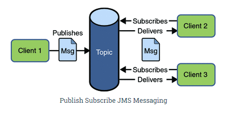
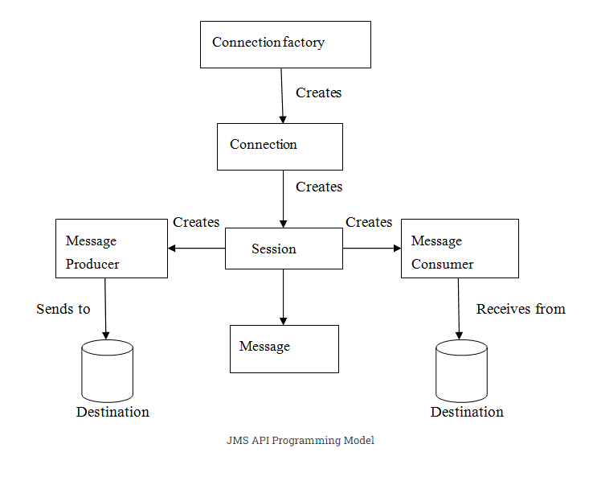
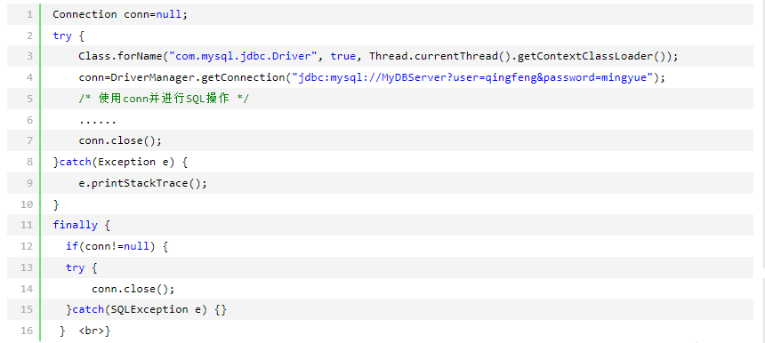

[toc]
## JMS(java message service)
什么是JMS：
两个应用程序之间进行异步通信的API，API为标准消息协议和消息服务提供通用的接口，包括创建、发送、读取消息等，这两个程序并不是直连，是通过一个共同的消息收发服务连接起来，达到解耦效果。 当然这是java定的规则，出了API，具体的实现，得看用啥，比如activemq

为什么需要JMS：
程序A触发事件后，B、C等想从A获取一些更新信息。 或者比如聊天服务，发布事件机制向所有与服务器相连的客户端发送消息，发送消息时，接受者不需要在线，等到客户端上线，能保证收到服务器发送的消息。

JMS优势：
1. 异步：客户端获取消息，不需要主动发送请求，消息会自动发送给可用的客户端。
2. 可靠：JMS保证消息只会投递一次。具体实现还是看各个中间件的实现

### JMS 消息传送模型
在JMS API存在前，就有很多消息产品支持 **点对点**或者 **发布/订阅** 方法，JMS 为这两个方法提供单独的实体和定义规范。 JMS提供商可以选择实现全部或者一个实体。

#### 点对点 消息传送模型
程序是基于 message queues(消息队列)、senders(发送者)、receivers(接收者) 构建。
每一个消息发送给一个特殊的消息队列，队列保留所有发送给它的信息除开 (消息被消费或者过期的)。

点对点的一些特征：
1. 对于每个消息来说，只有一个客户端。
2. 发送者和接收者没有时间依赖，你发送的时间和我接收的时间没有关系。
3. 发送者发送消息时，无论接收者在不在运行，都能获取到消息。
4. 接收者收到消息后，会发送确认收到通知。
  

#### 发布订阅模型
发布者发布一个消息，会通过topic传递给所有的客户端，topic负责保存和传递消息，并且一直保存消息直到消息被传递给客户端。

特征：
1. 消息可以被传递给多个订阅者。
2. 发布和订阅有时间依赖，订阅者只能消费这个订阅后的消息，并且订阅者必须保持在线
  

### 消息消费的两种方式

#### synchronous(同步)
使用同步方式接收，调用receive()方法，该方法会阻塞直到消息到达或者是超时了。

#### Asynchronous(异步)
订阅者可以register 成一个消息监听者，类似于事件监听器，只要消息到达，JMS供应商会调用监听者们的onMessage方法递送消息。

### JMS应用程序由如下基本模块构成
  

#### JMS 管理对象
1. Connnection Factories 连接工厂
2. Destinations 目的地
这两个对象由JMS系统管理员通过管理控制台创建，存储在应用程序服务器的JNDI名字空间或JNDI注册表。

扩展：JNDI是啥， java naming and directory interface  java命名和目录接口，提供一个目录系统，将服务名称和对象关联起来，让开发人员可以在开发过程中使用名称来访问对象。 如果注册的东西变化，我们只需要修改注册信息，名称不变，所以代码也不用修改。
没有JNDI的做法：
访问mysql数据库，将一个对Mysql jdbc驱动程序类的引用进行编码。
  
如果数据库服务器名称、用户名、口令变了， 那么jdbc url需要修改；数据库可能改用别的产品，就要修改jdbc驱动程序包和类名修改； 解决方法：其实程序猿不需要关心数据库后台、驱动程序是什么，url格式是什么，所以应该把这些问题交给J2EE容器来配置和管理，我们只需对这些配置和管理进行引用。

有了JNDI的做法：
在J2EE容器中配置JNDI参数，定义数据源，就是JDBC引用参数，给数据源设置一个名称，然后在程序中，通过数据源名称引用数据源从而访问后台数据库。比如我们在spring中写好配置文件，在程序中可以引用数据源。 所以JNDI避免了程序和数据库之间的紧耦合。

#### 连接工厂 ocnnection factories
连接工厂创建JMS服务提供者和客户端之间的连接，JMS客户端会在JNDI名字空间中搜索并获取连接，使用连接，客户端能与目的地通讯，往队列或topic发送/接收消息。

#### 目的地 Destination
指明消息被发送的目的地以及客户端接收消息的来源，JMS使用两种目的地，queue和topic

#### JMS connection
连接封装了与JMS提供者之间的虚拟连接，是被连接工厂创建出来的。

#### JMS session 会话
session是一个单线程上下文，用来生产和消费消息，可以创建消息生产者和消费者，session是被connection创建的。

#### message producer
消息生产者由session创建，往目的地发送消息。

#### JMS consumer
由session创建，接收目的地发送的消息。

#### Message Listener
是对消息的异步事件处理程序，实现onMessage方法。在方法中，定义要执行的操作。