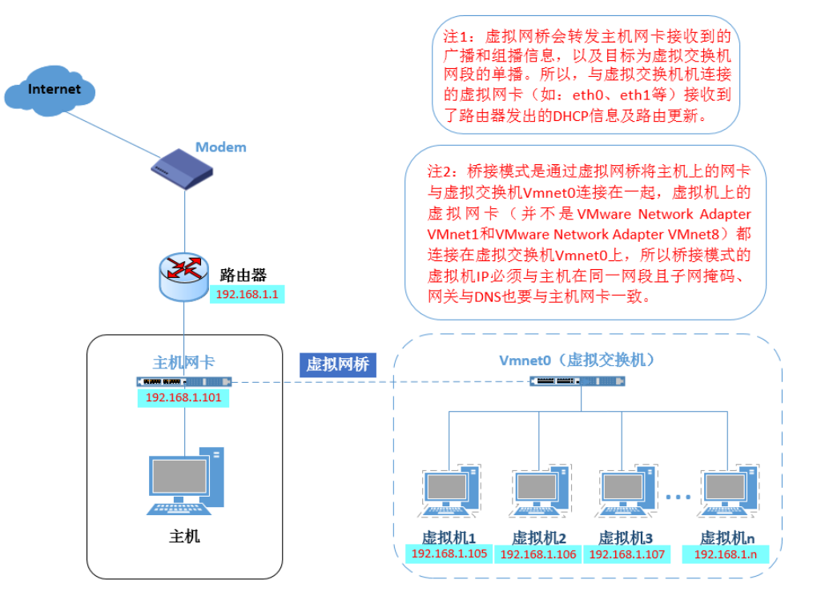
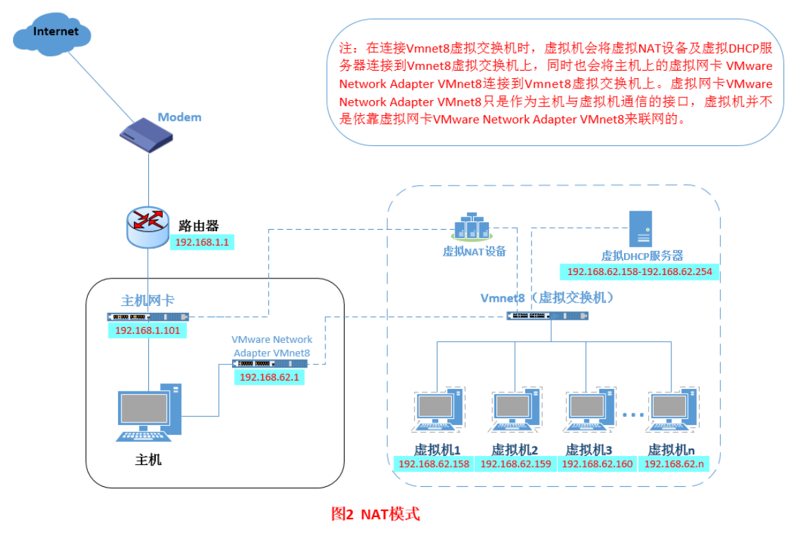

## 网络模式
1. bridged 桥接模式  
vmnet0就是桥接模式下的虚拟交换机，桥接模式是将主机网卡与虚拟机虚拟的网卡利用虚拟网桥进行通信，类似把物理主机虚拟为一个交换机，所有桥接的虚拟机连接到这个交换机的一个接口上，物理主机也同样插在这个交换机中，所有桥接下的网卡与网卡都是交换模式的，相互可以访问而不干扰，桥接模式下，虚拟机ip地址需要与主机在同一个网段中，如果需要联网，网关与dns需要与主机网卡一致。  
  
设置：  
先在vmare设置里，网络连接设置为桥接模式。然后进入系统前，确认主机的id地址，网关，dns等。
然后进入系统编辑网卡配置文件
```
vi /etc/sysconfig/network-scripts/ifcfg-eth0  
添加内容  
IPADDR=xxx.xxx.xxx.xxx  设置为虚拟机ip地址，与主机ip地址在同一个网段
NETMASK=255.255.255.0 设置子网掩码
GATEWAY=192.168.31.1 设置虚拟机网关,与主机相同
DNS1=192.168.31.1 设置虚拟机DNS，与主机相同
```
编辑完成保存退出，重启虚拟机网卡,使用ping命令，测试是否能联网。  
2. NAT(地址转换模式)
如果网络ip资源紧缺，又希望虚拟机能够联网，就用NAT，NAT用虚拟NAT设备和虚拟DHCP服务器，让虚拟机可以联网。  
  
主机网卡直接与虚拟NAT设备相连，然后虚拟NAT设备与虚拟DHCP服务器一起连接在虚拟交换机vmnet8上，这样实现了虚拟机联网，

### 问题解决
1. win10蓝屏
vmare虚拟机虚拟硬件时，将声卡、打印机这些移除，即可解决.
2. 静态IP配置
首先配置NAT，然后进入配置文件目录
```bash
cd /etc/netplan/ && ls 01-network-manager-all.yaml

network:
  version: 2
  renderer: NetworkManager
  ethernets:
    ens33:
      addresses: [192.168.30.30/24]
      dhcp4: no
      optional: true
      gateway4: 192.168.30.2
      nameservers:
        addresses: [8.8.8.8,8.8.4.4]
```
接着让配置生效
```
sudo netplan apply
```
然后再看ip addr 看生效没

