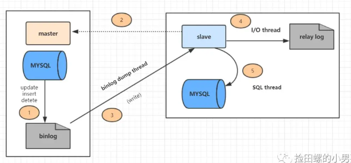
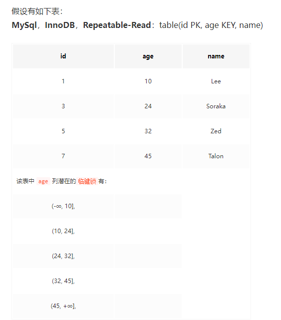

[toc]
## mysql 安装/卸载
mysql 安装  
```
查看有没有安装mysql
dpkg -l | grep mysql  
```
安装
```

   sudo apt-get install mysql-server -y
   sudo apt install mysql-client  -y
   sudo apt install libmysqlclient-dev -y
//查看检查是否安装成功
netstat -tap | grep mysql
```  

查看mysql服务运行是否正常
```
systemctl status mysql
```  
mysql查看权限表
```
use mysql;
select host,user,authentication_string,plugin from user;

//添加远程访问账号
create user 'phdb_user'@'%' identified by '123456';
grant all privileges on *.* to 'phdb_user'@'%';
alter user 'phdb_user'@'%' identified with mysql_native_password by '123456';
flush privileges;
```

配置mysql允许远程访问
```
vim /etc/mysql/mysql.conf.d/mysqld.cnf  
注释掉bing-address 那行,保存退出

重启服务
service mysql restart
```
mysql 卸载
```
apt purge mysql-*;
rm -rf /etc/mysql /var/lib/mysql
apt autoremove
apt autoclean
```


## mysql语法,存储过程
```

delimiter //;
CREATE PROCEDURE update_seal_apply_code (
	IN creditApplyId VARCHAR ( 40 )) BEGIN
	DECLARE
		done boolean DEFAULT 0;
	DECLARE
		tmpNumber INT DEFAULT 1;
	DECLARE
		creditSealApplyId VARCHAR ( 40 );
	DECLARE
		creditSealApply CURSOR FOR SELECT
		id 
	FROM
		credit_seal_apply 
	WHERE
		credit_seal_apply.credit_apply_id = creditApplyId;
	DECLARE
		CONTINUE HANDLER FOR SQLSTATE '02000' 
		SET done = 1;
	OPEN creditSealApply;
	REPEAT
			FETCH creditSealApply INTO creditSealApplyId;
		UPDATE credit_seal_apply 
		SET seal_apply_code = CONCAT( credit_contract_code, '-', tmpNumber ) 
		WHERE
			id = creditSealApplyId;
	set	tmpNumber = tmpNumber + 1;
		UNTIL done 
	END REPEAT;
	CLOSE creditSealApply;
	
END //;

delimiter ;

delimiter //;
CREATE PROCEDURE real_update_credit_seal_apply_code () BEGIN
	DECLARE
		done boolean DEFAULT 0;
	DECLARE
		tempId VARCHAR ( 40 );
	DECLARE
		creditApplyId CURSOR FOR SELECT
		credit_apply_id 
	FROM
		credit_seal_apply 
	GROUP BY
		credit_apply_id;
	DECLARE
		CONTINUE HANDLER FOR SQLSTATE '02000' 
		SET done = 1;
	OPEN creditApplyId;
	REPEAT
			FETCH creditApplyId INTO tempId;
		CALL update_seal_apply_code ( tempId );
		UNTIL done 
	END REPEAT;
	CLOSE creditApplyId;
END //;
delimiter ;

call real_update_credit_seal_apply_code();

drop PROCEDURE update_seal_apply_code;
drop PROCEDURE real_update_credit_seal_apply_code;
```

## mysql 语句
### 查看表的字段
```
select GROUP_CONCAT(COLUMN_NAME) from information_schema.COLUMNS where table_name = 'activity_info';  
```
### 日期
```sql
-- 加天数
DATE_ADD(approve_stamp_date,INTERVAL apply_term MONTH)
```

### mysql执行sql脚本
```
登录到mysql命令行
mysql -uxxxx -p

然后
source F:\hello world\niuzi.sql
```

## mysql主从
数据库主库对外提供读写操作，从库对外提供读操作。

### 为啥需要主从
1. 高可用，用于故障切换，比如主库挂了，可以切从库。
2. 读写分离，提供查询服务，减少主库压力，提升性能。
3. 备份数据，避免影响业务。

### 原理
1. 主数据库有binlog二进制文件，记录了所有的增删改sql语句(binlog线程)
2. slave把master的binlog文件的sql语句复制到自己的中继日志relay log(io 线程)
3. slave的relay log重做日志文件，再执行一次这些sql语句。(sql 执行线程)

  

如何保证主从一致的，说明情况不一致：
通过binlog保持一致。

不一致的情况：
1. master和slave在同步数据过程中中断，数据就会丢失。 所以master和slave之间维持一个长链接。
2. 如果slave和master选的索引不一致，可能会导致数据不一致，比如一条删除语句，a，b两个字段作为条件的limit 1. 这时master有索引a，所以limit出来的数据 可能和 slave有索引b limit出来的数据不一致。  当然原因还是因为binlog的格式设置为statement（记录sql原文）了，把格式改成row（记录删除的主键id信息）就可以了, 但是row格式空间，所以最后折中用mixed格式，当mysql判断数据可能不一致，就用row格式，否则就用statement格式。

### 主库宕机后，数据可能丢失的解决方案
为啥会数据丢失：因为主库提交不需要保证从库完全正确接收到，相应的当从库接受失败或者重做失败的情况下，主库无法感知。

半同步复制：master事务提交完成(after commit)，binlog落盘后，从库接受完binlog后给主库一个确认，但是并不管relay-log是否正确执行完，主库收到确认后，将commit ok返回给客户端。 但是也会带来问题：幻读、数据丢失
例如网络原因，主库迟迟收不到从库确认， 或者等待过程中主库宕机，数据库主节点切换到从库，由于主库事务已经提交，而从库并没有受到完整的binlog，反应到客户端可能就是，用户发现之前能查到订单，刷新后就查不到了。

为了解决这问题，推出了半同步复制增强，如果日志没有传输到从库，主库这时候也不会commit，若这时服务挂掉，主库从库军无法读到未提交的数据，解决了幻读和数据丢失。


### 主从延迟的原因和解决方案
定义：
1. master执行完一个事务，写入binlog，这个时刻为T1.
2. master同步给slave，slave接收完这个binlog的时刻，为T2.
3. 从库执行完这个事务，时刻为T3.

主从延迟，指同一个事务里，T3-T1的差值。

导致主从延迟的情况：
1. 从库的机器比主库性能差
2. 从库的压力大，也会导致主从延迟，因为从库查询消耗大量cpu，影响同步， 可以搞一主多从架构，多几个从库分担读压力。
3. 大事务也会导致主从延迟。
4. 网络延迟。
5. 低版本的mysql只支持单线程复制，可以换更高版本的mysql，支持多线程复制。


配置：
主机器的配置：
修改master节点的里/etc/mysql/my.cnf文件
```
[mysqld]
log-bin=mysql-bin # 开启 binlog
server-id=1 # 当前server在cluster中的id，必须保证在cluster中唯一
#只保留7天的二进制日志，以防磁盘被日志占满(可选)
expire-logs-days = 7
#不备份的数据库 （可选）
binlog-ignore-db=information_schema  
binlog-ignore-db=performation_schema
binlog-ignore-db=sys
```

接着创建一个用于slave的用户
```
CREATE USER 'slave' @'%' IDENTIFIED BY '123456';
GRANT SELECT, REPLICATION SLAVE, REPLICATION CLIENT ON *.* TO 'slave' @'%';
#刷新权限
FLUSH PRIVILEGES;

查看master状态，会有file和position值
show master status;
```

接着时slave节点，my.cnf添加内容
```
[mysqld]
server-id=2
relay_log=relay-log
#开启只读 意味着当前的数据库用作读，当然这也只会影响到非root的用户，如果使用root用户操作本库是不会有影响的
read_only=ON
```

设置完成后，启动slave server
```
CHANGE MASTER TO
MASTER_HOST='mysql-master', #因为用的docker，如果是实体机,这儿填对应ip
MASTER_USER='slave',
MASTER_PASSWORD='123456',
MASTER_LOG_FILE='mysql-bin.000001', #上面show master status的值
MASTER_LOG_POS=154; #上面show master status的值
```

然后启动slave
```
start slave;

show slave status;
主要看slave_io_running 和 slave_sql_running是否都是yes，是yes则说明成功了,如果slave_io_running是no，可能是
1. 两台节点的server_id相同
2. 两台节点的数据库uuid相同,就是/var/lib/mysql下的auto.cnf文件里的值相同，修改为不同就行了.
```


## 锁

行锁：行锁基于索引实现，如果某个枷锁操作没有使用索引，那么该锁就会退化成表锁

### 记录锁
为某行记录加锁，封锁改行的索引记录。

```
select * from table id=1 for update.

id为1的记录行会被锁住。  
```
id列必须为唯一索引列或者主键列，否则上面加的锁就会变成**临键锁**
查询语句必须为精准匹配，不能为>,<,like等，否则会退化成临键锁

通过主键索引与唯一索引对数据行进行update时，也会对该记录加记录锁。

### 间隙锁
基于非唯一索引，锁定一段范围内的索引记录，使用间隙锁 锁住的是一个区间，而不仅仅是这个区间中的每一条数据。
```
select * from table where id between 1 and 10 for update.
```
1到10内的记录行会被锁住

除了手动加锁外，执行完某些sql后，innodb也会自动加间隙锁。

### 临键锁(next-key locks)
next-key可以理解为一种特殊的间隙锁，通过临键锁可以解决幻读问题，每个数据行上的 非唯一索引列上都会存在一把临键锁，当某个事务持有该数据行的临键锁时，会锁住一段左开右闭区间的数据，innodb中行级锁是基于索引实现的， 唯一索引列上不存在临键锁

  

在事务A执行下面命令：
```
update table set naem=xxx where age = 24.

select * from table where age = 24 for update.

不管哪一句，之后如果在事务b中执行以下命令，则该命令会被阻塞
insert into table value(100,26,"xxx");
因为事务A在对age为24的列进行update操作时，获取了24,32这个区间的临键锁。
实际上获取的是10，32的区间
```
