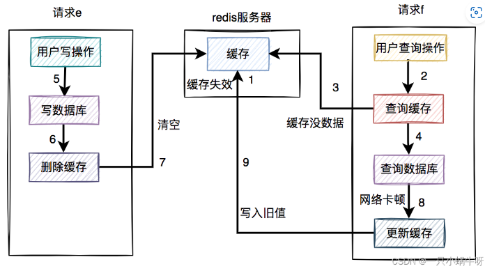

[toc]

## 安装
### redis为啥这么快
1. 基于内存
2. 数据结构好，速度会加快，这儿说的是存储string、hash、list、set、zset的底层数据结构，比如string底层是简单字符串对象，没有用c里的字符串(已/0结尾)，简单字符串里面有个len，表示字符串的长度，就能很快拿出字符串，而不用管是不是/0.
3. 是基于单线程的(网络io和读写)，不用考虑各种复杂情况，加快速度，比如没有线程上下文切换，加锁解锁，总之就是redis开发人员觉得单线程的收益比多线程大。
4. io复用，就是epoll，select了后还是单线程处理，而不是我们java里常用的select主线程收到后，分给子线程处理。

## 面试题
### 大量key需要设置同一时间过期，需要注意啥？
key的过期时间集中，到了过期哪个时间点，redis可能会出现短暂卡顿，一般需要在时间上加一个随机值。 如果不这样做，可能就会引出缓存雪崩，比如首页是缓存做的， 每秒6k请求，本来缓存可以抗住每秒5k个请求，但是缓存当时所有的key都失效了，此时1秒6k个请求全部落数据库，数据库必然扛不住，假如打到的是用户服务的库，那其他依赖他的库的就扣几乎都会报错，如果没有做熔断基本就是瞬间挂一片的节奏。

### 缓存穿透和击穿
缓存穿透是缓存和数据库中都没有数据，而用户不断发起请求，比如请求id为-1的数据，攻击就会导致数据库压力过大。 解决方法：可以在接口层添加校验，不合法的参数直接返回；从缓存取不到数据，数据库中也没有，可以将对应的key的value写为null，缓存有效时间设置短一点。

缓存击穿有点像缓存雪崩，但是击穿是指一个key非常热点，不停的扛着大并发，在这个key失效的瞬间，持续的大并发就穿破缓存，直接请求数据库。 解决方法：不设置过期时间，这时该key永远都有值，然后当该key更新时，就会删除该key，后续大量请求该key时，按照原来就会出现缓存击穿，我们在这儿加上互斥锁，只有第一个请求来判断key为空，然后顺利拿到锁，才会对该key写入，然后释放锁。后续进来的如果没有获取到锁，就while循环呗，后续进来的请求这时对于key已经拿到值了。


### redis持久化
两种方式：rdb和aof
rdb：将redis某一时刻的内存数据保存到硬盘的文件中，默认文件名dump.rdb,redis服务器启动时，会重新加载dump.rdb文件的数据到内存中恢复数据。开启方法：
1. 客户端向服务器发送save或者bgsave命令
save是同步操作，服务器会阻塞save命令后其他客户端的请求，直到数据同步完成。
bgsave是异步操作，fork一个子进程处理数据同步问题。
2. 服务器配置自动触发，redis.conf里
```
# 900s内至少达到一条写命令
save 900 1
# 300s内至少达至10条写命令
save 300 10
# 60s内至少达到10000条写命令
save 60 10000
```
优点：与aof方式相比，通过rdb文件恢复数据比较快
rdb文件非常紧凑，适合数据备份
由于使用子进程，对redis服务器性能影响较小

缺点：服务器宕机，丢失的数据会比较多


aof：每一次写操作命令，redis重启后，会加载并运行aof文件的命令，达到恢复数据的目的。
redis默认不开启aof持久化方式，在redis.conf文件中配置
```
# 开启aof机制
appendonly yes

# aof文件名
appendfilename "appendonly.aof"

# 写入策略,always表示每个写操作都保存到aof文件中,也可以是everysec或no
appendfsync always

# 默认不重写aof文件
no-appendfsync-on-rewrite no

# 保存目录
dir ~/redis/
```
写入方式：always，很慢
everysec：每秒写入一次aof文件，最多丢失1s数据
no：交给操作系统来处理，不确定，不推荐使用。

aof文件损坏处理：使用redis-check-aof命令修复

优点：aof只是追加日志文件，对服务器性能影响小，速度比rdb要快，消耗的内存较小。

缺点：aof生成的日志文件太大，恢复数据的速度比rdb慢。

生产中选择啥呢：
都要，当 redis 重启的时候会优先载入aof 文件来恢复数据，因为在通常情况下，AOF文件保存的数据集要比 RDB文件保存的数据集要完整

### 过期策略
定期删除+惰性删除
定期删除：默认100ms随机抽一些设置了过期时间的key，检查是否过期，过期了就删除了。
惰性删除：等你来查询时我看看过期没，过期了就删除了不给返回值。

所以最后，如果定期没有删除，我也没来查询，那岂不是越来越大，所以需要内存淘汰机制

### redis双写一致性


经典kv、db读写模式：
先更新数据库，再删除缓存：读的时候，先读缓存，缓存没有的话，就读数据库，然后取出数据后放入缓存，同时返回响应，更新的时候，先更新数据库，然后再删除缓存。

为啥删除缓存，因为更新缓存的代价很高，比如更新了某个表的字段，然后对应的缓存是需要查询其他表经过一系列计算才出来，所以代价高。 删除缓存其实就是个lazy的思想。

但是呢，假如在删除缓存那一步挂了，那数据不就不一致了， 好我们放在同一个数据库事务里，挂了回滚， 但是如果删除成功了呢，因为缓存的删除和数据库事务提交并不是一个原子性操作，所以有可能缓存删除了，事务还未提交时，另一个请求来，又给更新缓存了。  并且高并发业务场景，写数据库和删缓存都属于远程操作，防止出现大事务，通常建议写数据库和写缓存不要放在同一个事务中。

  

这种情况下，最后缓存里的值和数据库中最新的不一致。
但是这种情况出现的几率不大，因为查询数据库肯定比写数据库快嘛。 并且还得在缓存刚好失效时发生。

但是如果最后一步删除缓存失败了咋办，添加重试机制呗，重新删除3次，如果都失败，写入数据库后续处理(异步重试)。

## sentinel
监控：哨兵会周期性给所有主从库发送ping命令，检测他们是否仍然在运行
选主：主库挂了，哨兵基于一定规则评分选举出一个从库实例的新主库、
通知：哨兵会将新主库的信息发送给其他从库，让他们和新主库建立链接，并进行数据复制，哨兵会把新主库信息广播通知客户端。

哨兵对主库的下线判断：
1. 主观下线：哨兵进程用ping命令检测它自己和主、从库的网络连接情况，如果发现响应超时，哨兵会把它标记为主观下线。
2. 客观下线：在哨兵集群中，基于少数服从多数，多数实例都判定主库已主观下线，则认为主库 客观下线。

哨兵集群中哨兵之间如何通信：基于redis提供的发布/订阅机制。

数据问题：
redis实现高可用，但实现期间会产出一些风险：
数据丢失-主从异步复制：master将数据复制给slave时异步的，复制过程中master挂了，这时部分数据就丢了。
数据丢失-脑裂：在集群中，master网络故障，哨兵给切换了，选出新的master，但是client还没来得及切换到新的master，还继续往旧的master写数据，当旧master恢复时，会被当做一个slave挂到新的master上，自己的数据清空，从新的master复制数据，这样导致数据缺失。

解决方法：
```
这两个选项可以防止master在不安全的情况下执行命令
min-slaves-to-write 3
min-slaves-max-lag 10

从服务器的数量少于3，或者3个从服务器的延迟值都>=10s时，master将拒绝执行写命令
```