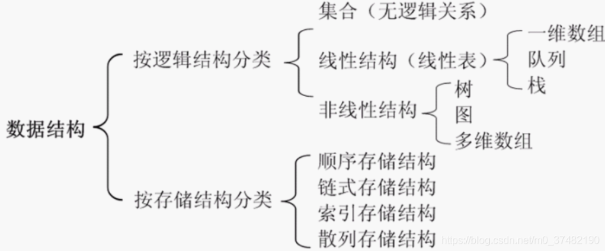

## 定义
数据结构是一种数据组织、管理和存储的格式。
  

### 线性结构
数据元素中存在一对一的线性关系的数据结构，是一种有序数据元素的集合。  
常用的线性结构有：线性表，栈，队列，双队列，循环队列，一维数组，串  

### 非线性结构
各个数据元素不在保持在一个线性序列中，数据元素是一对多或者多对一的关系，可以分为树或者图

#### 树
##### 二叉树
每个节点至多只有两棵子树，二叉树的第i层至多有2的i-1次方个节点。  
满二叉树：除了最后一个层没有任何子节点，节点数达到最大值，所有叶子节点必须在同一层上。
一个层数为k的满二叉树的总结点数为：(2的k次方)-1，所以总结点数一定是奇数；第i层上的节点数为2的k-1次方。  

完全二叉树：若层数为k，则除了k层外，其他各层的节点数都达到最大个数，第k层所有节点都连续集中在最左边