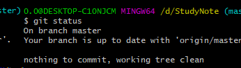
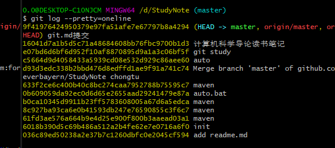

## 是什么
版本控制工具，版本控制，工程设计领域中使用版本控制管理工程蓝图的设计过程

## 具备的功能
1. 协同修改 ：多人并行的修改服务器端的同一个文件
2. 数据备份 ：保存目录和文件的当前状态，还能保存每一个提交过的历史状态
3. 版本管理 ：保存每一个版本的文件信息的时候要做到不保存重复数据，节约存储空间，提高运行效率，git采用文件系统快照的方式。
4. 权限控制 : 队团队中参与开发的人员进行权限控制
5. 历史记录 ：能够查看修改人、修改时间、修改内容、日志信息
6. 分支管理 ：开发团队在工作过程中多条生产线同时推进任务，提高效率

## Git结构
1. 工作区 ：写代码的地方
2. 暂存区 ：临时存储，打算要提交的地方
3. 本地库 ：历史版本  
工作区用git add将代码放入暂存区，在暂存区用git commit将代码加入本地库 

## git命令行操作
### 本地库操作
1. 本地库初始化： git init ；生成.git目录，存放的是本地库相关的子目录和文件，不要删除和修改
2. 设置签名： 形式      用户名：tom，Email地址：good@11.com  作用是区分不同开发人员的身份；  
   > 命令  
   >> 项目级别/仓库级别:仅在当前本地库范围内有效  
   >>> git config user.name tom_pro  
   >>> git config user.email tom@11.com  

   > 命令
   >> 系统用户级别：登录当前操作系统的用户范围  
   >>> git config **--global** user.name tom_pro  
   >>> git config **--global** user.email tom@11.com  

   > 级别优先级：就近原则  
   
   可以在.git/config下查看到

3. git status  

第一行，在master分支上；第二行，现在没啥提交的  
4. git rm --cached good.txt 将暂存区的文件移除  
5. git log --pretty=oneline 可以查看提交的日志

那串值其实是hash值，HEAD是指针，指向当前的版本
6. git reflog 可以看到HEAD的下标
7. git reset ，版本回退或向前
    > 通过hash值回退: git reset --hard hash值  
    > 通过^,只能回退不能向前:git reset --hard HEAD^ 往回退一步,如果想回退2步，就使用HEAD^^  
    > 通过~,回退是三步,git reset --hard HEAD~3  

参数hard和soft和mixed对比：
soft：仅仅在本地库移动HEAD指针。那么暂存区相对于本地库而言，就是前进了，所以用git status，会发现有add的文件。  
mixed：在本地库移动HEAD指针，重置暂存区，暂存区也重置了，那么工作区的代码，相当于都没add进暂存区，用git status会看到有红色的文件。  
hard：在本地库移动HEAD指针，重置暂存区，重置工作区  

8. git diff: 比较文件的差异
9. git rebase: 假设目前只有一个分支，开发人员的工作流程是  
   > 1. 切到master分支，git pull拉取最新的分支状态  
   > 2. 本地创建一个开发分支
   > 3. 开发完成后，切到master，git pull拉取最新分支状态
   > 4. 切回local分支，通过git rebase -i 将本地的多次提交合并为一个，简化提交历史，本地有多个提交时，如果不进行这一步，在git rebase master时会多次解决冲突(有可能每一个提交都会有一个解决冲突)  
   > 5. git rebase master 将master最新的分支同步到本地，这个过程可能需要手动解决冲突  
   > 6. 切换到master，git merge将本地local分支内容合并到mater分支

## 分支
### 命令
1. git branch -v ： 查看所有分支
2. git branch hot_fix ：创建一个新分支
3. git checkout hot_fix 切换分支
4. 合并分支，先切换到接收修改的分支上,然后解决冲突 git merge 另一个分支名字

## 基本原理
### hash
#### 特点
1. 不管输入数据量多大，输入同一个哈希算法，得到加密结果长度固定。
2. 哈希算法确定，输入数据确定，输出数据能够保证不变。
3. 哈希算法确定，输入数据变化，输出数据一定有变化。
4. 哈希算法不可逆
5. git底层采用sha-1算法