[toc]
## present
### am/is/are
i am late
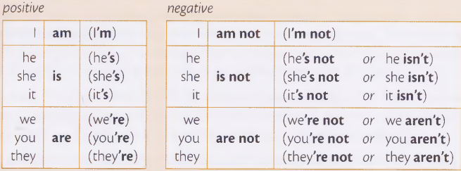 

对am/is/are的提问  
Am i late?
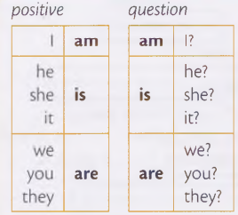 

对一般疑问句的回答
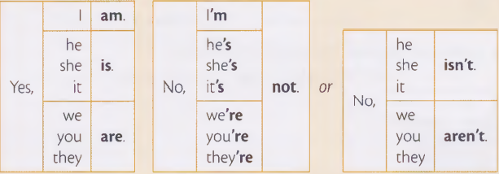 


特殊疑问句：
where/what/who/how/why?  
1. Where is your mother? 对地点提问 your mother is xxx.
2. What color is your car? 正常是:your car is red.
3. Who is he?
4. how old is joe? 对年龄提问
5. Why is it so expensive?  

### present continuous 现在进行时
定义：something is happing now  现在发生的
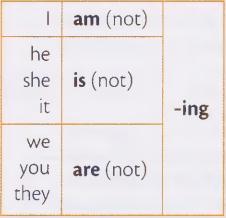 

i am working. i am not watching tv.

ing的特殊变化
```
come->coming  write->writing  dance->dancing  run->running 
sit->sitting  swim->swimming  lie->lying
```

对 present continuous的提问：
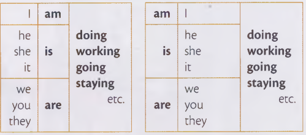 

Are you feeling OK?  

对一般疑问句的回答：
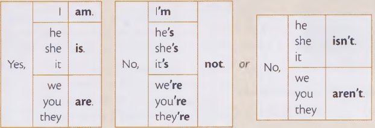 

特殊疑问句:
Where is he working today?

### present simple 一般现在时  
对一般性事实、或者经常发生、一直发生的，用一般现在时

i work in a shop. my brother works in a bank.  

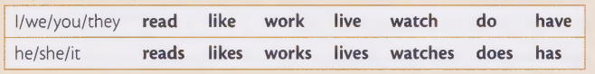 

三单动词变形
```
-es 加在 -s/-sh/-ch后：pass->passes  finish->finishes  watch->watches.  
-y结尾变成-ies : study->studies  try->tries  
also: do->does  go->goes
```  

对程度的修饰+一般现在时  
always/never/often/usually/sometimes + present simple  

Jack always gets to work early.  

对于一般现在时的否定：  
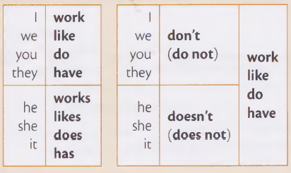 

对于一般现在时的提问：  
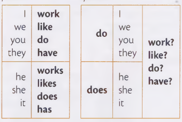 

如果是特殊疑问句：  
Where do you wash your hair?  

```
这些verbs 不能用在现在进行时  

like    want    know    understand  remember
prefer  need    mean    believe     forget
```  

i have == i have got 意义一样  
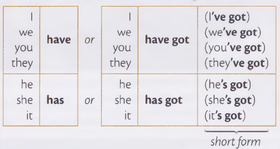 

对他的提问  
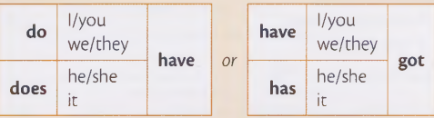 

### past simple 一般过去时
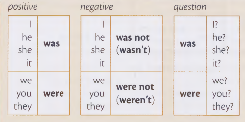 

Last year Tom was 22,so he is 23 now.  

When i was a child,i was scared of dogs. 

Was the weather nice when you were on holiday?  

回答：  
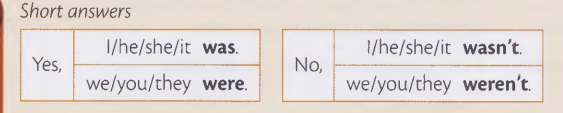 

对于主谓宾形式的一般过去时,要注意动词的变形
This morning i cleaned my teeth.  

past simple negative and questions:  

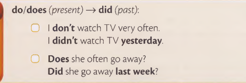  

回答是：  
Yes,i did.  No,i didn't.

特殊疑问句：  
What did your sister call you?  

How did the accident happen?  

### past continuous 过去进行时 
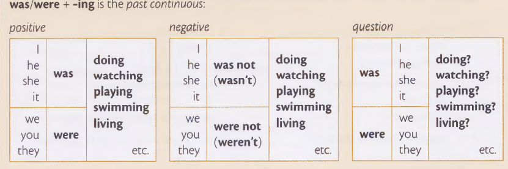  

It was raining,so we did't go out.

一般过去时和过去进行时的区别：  
1. 一般过去时： 
    > 完整描述一个动作开始和结束. Tom went to paris last summer.
    > 描述过去连续发生的行为. He came home,switched on the laptop.
    > 用于下面这些结构：  
    >> i used to ride a bicycle to school.  
    >> i was eating dinner when he **came**.
    >> if i were you,i wouldn't get engaged to him.  

2. 过去进行时：
    > 描述过去某个时间点发生的动作. What were you doing at 8:30 last night?
    > 描述当另一个动作被打断时(过去) 正在发生的动作。进行中的动作使用过去进行时，干预动作使用一般过去时。 When i came yesterday,he was sleeping. 干预的动作就是我进来， 进行中的动作是他在睡觉。
    > 描述过去同时发生的行为：Yesterday,i was cooking while my sister was washing the dishes.


### present perfect 现在完成时
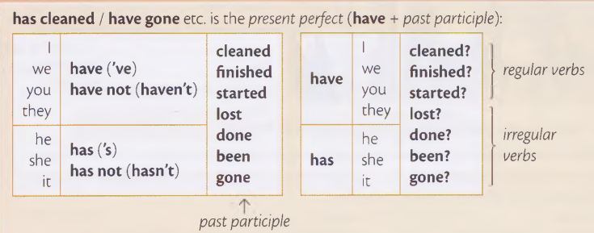  

啥时候用present perfect：过去的动作，现在的结果。  
I've lost my passport. = I can't find my passport now.  

**i've just / i've already / i haven't...yet.** 区别:

1. just = a short time ago.
They have just arrived. 他们刚到.
2. already = before you expected 在预料之前
They have already arrived.（在预料之前就到了）
3. yet = until now.
yet 常使用在否定句和提问里面,yet常放在最后。
No,they have't arrived yet.
Have A and B arrived yet?

**Have you ever...?**
Have you ever been to Japan?     时间是从过去到now.

**gone and been**
区别： 都是过去分词，用于完成时，都可以用来谈论一段经历或旅程，been表示旅程已经结束，并且已经返回了出发地。而gone表示旅程仍然在进行中，未返回出发地。  
所以 Where has she gone？就等于 Where is she now?

**How long have you ...?**
How long has she been in Ireland? 她在爱尔兰多久了？

**for/since/ago**

用for/since来回答How long。
for+a period of time.  for后面跟一段时间
例子：Tom has been in Canada for six months. Tom在加拿大6个月.

since + the start of the period. since后跟一个开始时间.
Tom has been in Canada since January.=from January to now.
i have lived in London since i was ten years old.

ago = before now. 常用于过去式
Tom started his new job three weeks ago = three weeks before now.

一般过去式和现在完成时区别：
1. 不要在现在完成时里用已经结束的时间。
i saw Paula yesterday. 不能说 i have seen paula yesterday.


### passive 被动语态
1. 一般现在时和一般过去时的被动语态.

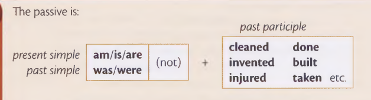  

The office is cleaned every day.  

The office was cleaned yesterday.

对于born，出生来说，必须使用过去时
I was born in Berlin in 1993.  Where were you born?

passive + by..
The telephone was invented by Bell in 1876.

2. 现在进行时、现在完成时
is/are being（现在进行时被动）：The door is being painted.


has/have been（现在完成时被动）: The door has been painted.
