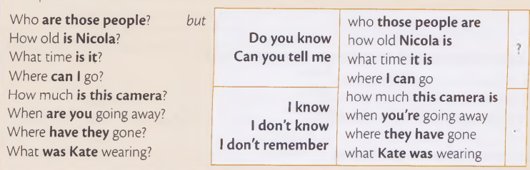
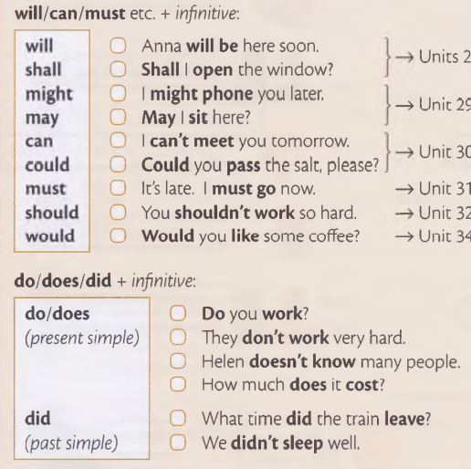
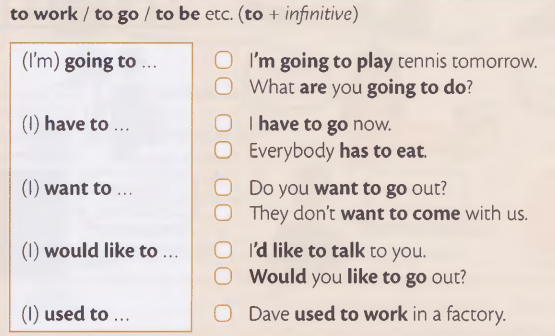

[toc]
## present
### am/is/are
i am late
 

对am/is/are的提问  
Am i late?
 

对一般疑问句的回答
 


特殊疑问句：
where/what/who/how/why?  
1. Where is your mother? 对地点提问 your mother is xxx.
2. What color is your car? 正常是:your car is red.
3. Who is he?
4. how old is joe? 对年龄提问
5. Why is it so expensive?  

### present continuous 现在进行时
定义：something is happing now  现在发生的
 

i am working. i am not watching tv.

ing的特殊变化
```
come->coming  write->writing  dance->dancing  run->running 
sit->sitting  swim->swimming  lie->lying
```

对 present continuous的提问：
 

Are you feeling OK?  

对一般疑问句的回答：
 

特殊疑问句:
Where is he working today?

### present simple 一般现在时  
对一般性事实、或者经常发生、一直发生的，用一般现在时

i work in a shop. my brother works in a bank.  

 

三单动词变形
```
-es 加在 -s/-sh/-ch后：pass->passes  finish->finishes  watch->watches.  
-y结尾变成-ies : study->studies  try->tries  
also: do->does  go->goes
```  

对程度的修饰+一般现在时  
always/never/often/usually/sometimes + present simple  

Jack always gets to work early.  

对于一般现在时的否定：  
 

对于一般现在时的提问：  
 

如果是特殊疑问句：  
Where do you wash your hair?  

```
这些verbs 不能用在现在进行时  

like    want    know    understand  remember
prefer  need    mean    believe     forget
```  

i have == i have got 意义一样  
 

对他的提问  
 

## past
### past simple 一般过去时
 

Last year Tom was 22,so he is 23 now.  

When i was a child,i was scared of dogs. 

Was the weather nice when you were on holiday?  

回答：  
 

对于主谓宾形式的一般过去时,要注意动词的变形
This morning i cleaned my teeth.  

past simple negative and questions:  

  

回答是：  
Yes,i did.  No,i didn't.

特殊疑问句：  
What did your sister call you?  

How did the accident happen?  

### past continuous 过去进行时 
  

It was raining,so we did't go out.

一般过去时和过去进行时的区别：  
1. 一般过去时： 
    > 完整描述一个动作开始和结束. Tom went to paris last summer.
    > 描述过去连续发生的行为. He came home,switched on the laptop.
    > 用于下面这些结构：  
    >> i used to ride a bicycle to school.  
    >> i was eating dinner when he **came**.
    >> if i were you,i wouldn't get engaged to him.  

2. 过去进行时：
    > 描述过去某个时间点发生的动作. What were you doing at 8:30 last night?
    > 描述当另一个动作被打断时(过去) 正在发生的动作。进行中的动作使用过去进行时，干预动作使用一般过去时。 When i came yesterday,he was sleeping. 干预的动作就是我进来， 进行中的动作是他在睡觉。
    > 描述过去同时发生的行为：Yesterday,i was cooking while my sister was washing the dishes.


## perfect
### present perfect 现在完成时
  

啥时候用present perfect：过去的动作，现在的结果。  
I've lost my passport. = I can't find my passport now.  

**i've just / i've already / i haven't...yet.** 区别:

1. just = a short time ago.
They have just arrived. 他们刚到.
2. already = before you expected 在预料之前
They have already arrived.（在预料之前就到了）
3. yet = until now.
yet 常使用在否定句和提问里面,yet常放在最后。
No,they have't arrived yet.
Have A and B arrived yet?

**Have you ever...?**
Have you ever been to Japan?     时间是从过去到now.

**gone and been**
区别： 都是过去分词，用于完成时，都可以用来谈论一段经历或旅程，been表示旅程已经结束，并且已经返回了出发地。而gone表示旅程仍然在进行中，未返回出发地。  
所以 Where has she gone？就等于 Where is she now?

**How long have you ...?**
How long has she been in Ireland? 她在爱尔兰多久了？

**for/since/ago**

用for/since来回答How long。
for+a period of time.  for后面跟一段时间
例子：Tom has been in Canada for six months. Tom在加拿大6个月.

since + the start of the period. since后跟一个开始时间.
Tom has been in Canada since January.=from January to now.
i have lived in London since i was ten years old.

ago = before now. 常用于过去式
Tom started his new job three weeks ago = three weeks before now.

一般过去式和现在完成时区别：
1. 不要在现在完成时里用已经结束的时间。
i saw Paula yesterday. 不能说 i have seen paula yesterday.


## passive 被动语态
1. 一般现在时和一般过去时的被动语态.

  

The office is cleaned every day.  

The office was cleaned yesterday.

对于born，出生来说，必须使用过去时
I was born in Berlin in 1993.  Where were you born?

passive + by..
The telephone was invented by Bell in 1876.

2. 现在进行时、现在完成时
is/are being（现在进行时被动）：The door is being painted.


has/have been（现在完成时被动）: The door has been painted.

## future
### 一般将来时 future

1. 可以使用现在进行时表示将来,一般是已经安排好的，计划好的事情,不是临时决定：
I'm not working next week.

2. 对于时刻表、节目单、火车、汽车时间点，用一般时表将来：
The train arrives at 7.30. 
What time does the film finish?

3. I'm going to do something,从过去开始就决定了要做的事
i'm going to bug some books tomorrow. 
Sarah is going to sell her car.

4. 如果有事情快要发生了，我们现在看得到，也用is going to
Look at the sky! it's going to rain.

5. will/shall
shall只能用于第一人称,will 都可以；他们两个都是用于没有计划的事。

经常用的: i think i wll / i don't think i will.

## Modals/imperative  情态动词/祈使句

### might
might + 动词原形
i might = it is possible that i will.
就是说我有可能会做. 但不是一定做，是没有确定的
I might go to the cinema this evening, but i'm not sure.

否定形式就是：
i might not go to work tomorrow.

同样的,可以使用may来替换，may=might.

May i ask a question?

### can / could
can/could + 动词原形

i can do sth = i know how to do it,or it is possible for me to do it.

i can play the piano,My brother can play the piano too.

提问：
Can you swim?

如果是past状态,则用could/couldn't

When i was young, i could run very fast.

### must / mustn't / don't need to
i must = i need
I'm very hungry, i must eat something.
如果是past,因为must没有过去时,所以我们需要用had to
I was very hungry,i had to eat something.

mustn't = must not
I must go,i mustn't be late.

don't need to = it is not necessary
i don't need to go yet,i can stay a little longer.

### should
should + 动词原形

should do sth = it is a good thing to do,it is the right thing to do

It's a good film. You should go and see it.

shouldn't = should not
Tom shouldn't go to bed so late.

我们经常用： i think....should...
i think Lisa should buy some new clothes.
提问的话：
Do you think ... should...?
Do you think i should buy this hat?

Must要比should更加强烈.

should可以和ought to 互换.

### i have to 不得不
在过去时中：就会变成 had to

提问的话：
Do i have to...?

must 和 have to的区别
1. must侧重说话者的主观看法,认为有必要有义务去做某事, have to 则重于客观需要,有不得不、被迫的意义.
2. 时态上不同,must只有现在时一种形式,have to有多种，表示过去用had to

### Would you like...? i'd like...
Would you like = Do you want..
Would you like some coffee? 你想要点咖啡吗

Would you like to 可以邀请某人：
Would you like to go for a walk?

i'd like 是i want 的礼貌的说法 = i would like

Would you like 和 Do you like 的区别：
Would you like是问你想要...   Do you like 是问你喜欢...?


### Do this! Don't do that! Let's do this!
祈使句
我们用Come/look/go/wait/be 等， 当我们告诉某人做某事时
Come here and look at this!
Go away!
please be quiet.
同样的：
Have a good time!
Have fun!

当告诉人不要做某事时：
Be careful! Don't fall.

Let's = let us.  当你想人和你一起做某事时
Let's go out.
否定的话：
Let's not go out.

### i used to
我曾经...,但是现在不了
Helen used to have a piano , but she sold it a few years ago.
否定形式:
I didn't use to like tomatoes.
提问：
Did you use to live...

used to只能用在过去


## There be句型
There is/are
There was/were
There has/have been
There will be

It's nice/easy/safe to...
It's nice to see you again.


## Auxiliary verbs 助动词
助动词与实义动词是相对的，协助主要动词构成谓语动词词组的叫助动词。 助动词就像僚机

助动词的作用：
1. 表示时态：He is singing.
2. 表示语态：He was sent to England.
3. 构成疑问句：Do you like college life?
4. 与否定副词not合用：I don't like him.
5. 加强语气：Do come to the party tomorrow evening.

常用的助动词：
be is am are was were
do does did
have has had
shall should
will would

It's a beautiful day,isn't it?   一个人说的,前一句和后一句要反过来,前面肯定,后面就是not的反问,回答的话，就是回答他第一句,Yes,it's perfect! 不用管他的反问.

That isn't your car,is it?  No,it's my mother's.


too/either
放在句子的最后， too用在positive 肯定中， either用在negative 否定中
i'm happy.  i'm happy too.
i'm not happy.  i'm not happy either.


so am i / neither do i
so am i = i am too .     neither am i = i'm not either. 我们还可以用Nor 代替neither. Nor am i.

## 提问
Silvia saw Paul.
对Silvia提问：Who saw Paul?
对Paul提问：Who did silvia see?

疑问词代替的是主语,那后面的句式不变,如果代替的是宾语,则需要修改句式：
What happened?  
Who did you meet yesterday?


在问句中, Who/What/Where/which开头的，通常以介词to/from/with结尾
Where are you from?
What was he afraid to?


What is it like? = 告诉我sth咋样,是好的还是坏的，是大的还是小的
同理：What are they like 也一样，许哟啊结合语境

What + 名词：What color is your car?
What 后不接名词：What is your favourite color?

Which + 名词：Which train did you catch?
Which 后不接名词,不接人：Which is bigger?- Canada or US?

Who 是用来接人的：Who is taller - Joe or Gary?


What 和 Which的区别： Which是在少数可能性中做选择,而What范围则更大：
There are four umbrellas here. Which is yours? 四把伞，其中一把
What's the capital of China? 中国有很多城市,哪个是首都.


How..?   how + adj/adv (how tall/old/often)
How far 问距离。 How often 问频率 How long 问时间  How much 问多少钱
How long have they been married? 他们结婚多少年了

How long does it take from ..to..?
How long does it take by plane from New York to Washington?
It takes ten minutes by car from my house to the station.

How long does it take to do sth  take后面的动作需要花多少时间
How long does it take to cross the Atlantic by ship? 乘船横渡大西洋需要多久
It takes a long time to learn a language. 学习语言是需要很长的时间


Do you know where ...?
正常情况下, Where is Paula? 但是如果是这个句式：Do you know where Paula is?
  

同样的 Where does he live?
Do you know where he lives? 注意这样后面是lives。

在这些句子里if和whether可以互换
Do you know if they have got a car?
Do you know whether they have got a car?


## to do 或者 doing
  
  


```
want / plan / decide / try
hope / expect / offer(提出) /forget       +  to
need / promise / refuse / learn
```

```
enjoy / stop                    + -ing
mind(介意) / finish / suggest
```

```
like / love / start   continue  + -ing / to do
prefer / hate / begin 
```

```
would like/love/prefer/hate  + to do
```