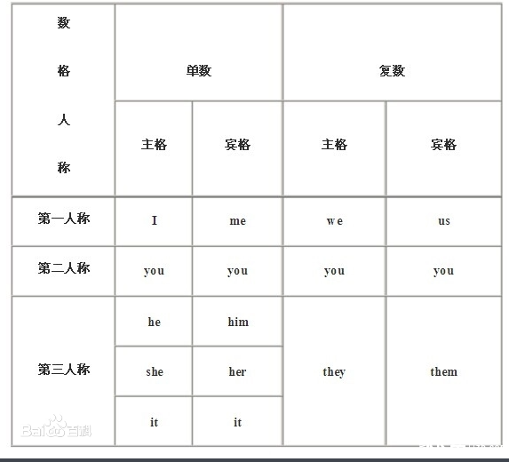

[toc]

## 第一册
### 1
一般疑问句：通过主谓倒装可将带有be的陈述句变为一般疑问句,将be的适当形式移到主语前.  
This is your watch.  
Is this your watch?  
一般疑问句的回答: Is she ...? 回答是 Yes,she is | No,she isn't  

形容词性物主代词:my/your/his/her/our/its/their 表示谁的,起形容词的作用，后面接名词.  
名词性物主代词: 单数形式 mine/yours/his/hers/its/Ben's 复数形式 ours/yours/theirs 起名词的作用

特定套路回答：Is this your pencil?  
Is this/that ? 回答用 It's.就算是问的关于人 Is this your brother. 回答也是It is.  
Are these/those ? 回答用 They are.  

人称代词：  
  

### 3
地点副词：here/there/home/abroad/downstairs/upstairs 时间/地点副词前不能加介词.  
祈使句：主语通常不直接表示出来,谓语动词用原型,也叫做无主句,常表示命令、请求、建议、叮嘱,句子真正主语是你，但是省略了。 
Come and see this goldfish.  
倒装句: here is 是最简单的倒装句,be动词放在here后面。  
正常: my ticket is here .  
倒装：here is my ticket。  
here are youre bags and coat. be动词就近原则,所以这里用are