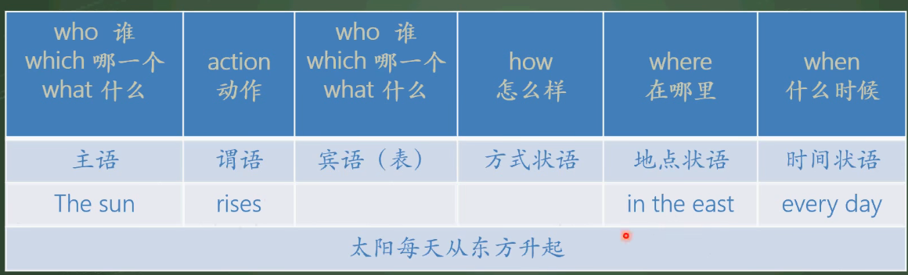

## 句子的结构
主语、谓语、宾语、表语、定语、状语、宾补。  
1. 主语(定语) + 谓语(状语) + 宾语(定语) + 宾补，括号内是修饰前面那个的。
2. 主语 + 系动词 + 表语

```
例子：
 XQ     sings   beautiful   songs   every day.
 主     谓        定           宾      状。
 美丽的修饰歌，所以是定语，   每天修饰唱，  每天唱， 所以是状语。
```

**英语的语序，其中句子的主干，就是主谓宾或主系表的语序和汉语的语序是相同的，不同的是，定语和状语的位置。汉语中定语和状语分别修饰主谓宾和谓语，修饰谁就放在谁的前面，英语中定语修饰主语和宾语，位置有时在前，有时在后；状语就更自由，不过还是喜欢后置**
```
桌子上的那本书是小强的英语书  
The book    one the desk      is          xq's      English     book.
   主           定             系           定           定       表    

正在等我的那个人正在高兴地听着音乐  
The person          waiting for me      is listening to         music       happily.
    主                  定                    谓                  宾           状 
```

### 主语
可以做主语成分的：
1. 名词：Friendship is the most important thing in his life. in his life 是地点状语
2. 代词: Every one needs friends.
3. 动名词(把动词变成名词): Reading books is important for us.
4. 动词不定式:To read books is important for us./ It(形式主语) is important for us to read books.对我们来说读书是重要的. 翻译顺序
5. 主语从句(句子做主语)

### 宾语
可以做宾语成分的：
1. 名词：I will find an ideal job.
2. 代词：Love me. me是宾语
3. 动名词：Do you mind passing me the book? 你介意把那本书递给我吗? mind 是谓语，passing是宾语
4. 动词不定式：we want to improve our English.
5. 宾语从句：I believe (that) you can get along well with them 我相信你能和他们相处的很好.  


以下动词做谓语，后面只能跟动名词做宾语:  
```
喜欢、享受 enjoy doing 、 完成 finish doing/complete doing  
练习 practice doing 、 想象 imagine doing  
介意 mind doing 、 考虑 consider doing  
建议 advise doing/suggest doing 、 错过 miss doing 
冒险 risk doing 、耽搁 delay doing
放弃 give up doing 、 推迟 put off doing  
突然 burst out doing 、致力于、献身 devote to doing
期盼 look forward to doing 、注意 pay attention to doing
专心做 get down to doing 、喜欢/愿意 feel like doing
情不自禁 can't help doing 、无法停止做 can't stop doing 
无法理解做 can't understand doing.
```
以下动词做谓语，只能跟to do 动词不定式做宾语:
```
同意 agree to do 、 决定 decide to do
想要 want to do 、拒绝 refuse to do
希望 wish to do 、 设法完成 manage to do
期望 hope/expect to do 、 准备 prepare to do
匆忙去做 hurry to do 、 计划 plan to do
主动提供 offer to do、学会做 learn to do
答应 promise to do 、 假装 pretend to do
```
以下动词做谓语，既能doing也能to do 做宾语，但是意思有区别:
```
stop doing 停止做手边的事 / to do 停下来去做另外的事
like doing 习惯性喜欢 / to do 偶然性喜欢
go on doing 继续做同一件事 / to do 继续做另外一件事
try doing 尝试做 / to do 尽力做
remember doing 记得做过某事,已经完成了 / to do 记得去做某事
forget doing 忘记做过 / to do 忘记去做
regret doing 后悔做过 / to do 遗憾去做
mean doing 意味着 / to do 有心的 故意的
```


### 表语
用来说明主语的身份、特征、性质和状态。  
系动词：
1. be 动词
2. 感官系动词：看起来look/seem，听起来 sound，闻起来 smell，尝起来 taste ，感觉 feel
3. 变成，成为: become、turn、grow、get
4. 活用为系动词的动词：keep、stay、remain、leave，都有保持保留的意思。 

可以做表语的成份有：
1. 名词 What i need is (a popular book).
2. 代词 Who can make you happly is yourself.
3. 动名词 My work is teaching you English.
4. 动词不定式 My dream is to become a dancer.
5. 形容词 Difficulties are (helpful) to us.
6. 分词，现在分词和过去分词，具有形容词的性质 This book is very (interesting)./ My cup is (broken).
7. 介词短语(介词+名词):one the desk.  
8. 副词: Everyone is (here) today 今天每个人都在这儿了
9. 表语从句：That is (why i was late for school)


### 谓语
说明主语的动作、状态、特征，是由动词的各种形式来充当的，并且和主语的人称和数保持一致。
谓语的动词情况：
1. 不及物动词或不及物动词短语，不加宾语：(时光飞逝) Time flies. 
2. 及物动词或不及物动词加介词,后面加宾语: (我经常想象我未来的生活会是什么样子) I often imagine what my life will be like in the future.
3. 情态动词+动词原型: I can fly and i can touch the sky.

注意： **凡是涉及到谓语动词，一定注意时态和语态，其次是主谓一致问题，就是主语和谓语在人称和数上要一致**

### 定语
在句子中修饰主语或宾语的成分，在词性上，定语是修饰名词的

做定语的：
1. 形容词
2. 副词
3. 数词
4. 代词
5. 分词:(现在分词，表示被修饰名词的性质和状态) The coming person is one of my friends
6. 动词不定式
7. 动名词:表示被修饰词的功能和作用；swimming pool
8. 介词短语
9. 名词 The (summer) holiday was over.
10. 定语从句

定语的位置：一般单独的词做定语放在被修饰词之前；短语或句子放在被修饰词之后

### 宾语补足语
用于补充说明宾语，使句子意思更加完整，宾补均在表示宾语的一个状态，特征、性质或动作。

可以做宾语补足语的：
1. 名词
2. 形容词
3. 动名词doing: we call this swimming.
4. 现在分词doing: 相当于adj, I heard the telephone ringing.
5. 过去分词done
6. 动词不定式to do
7. 介词短语
8. 副词

### 状语
修饰谓语动词、形容词、副词或者整个句子

可以做状语的成分：
1. 副词及副词性词组：He speaks English (very well).
2. 介词短语: XQ likes chatting on the line.
3. 不定式 to do: To learn English well,you should work hard on it.
4. 分词和分词短语: XQ broke his arm while playing football.
5. 状语从句
6. 相当于副词的词或者短语

## 五个基本句型
1. 主系表： Every one (should keep) healthy.
2. 主谓宾：i eat an apple.
3. 主谓：I jump.
4. 主谓宾宾: The teacher gave me (a book).  看动作直接作用在谁身上，谁就是直接宾语. 动作间接作用在谁身上，就是间接宾语。  所以书是直接宾语。
My father bought me a new guitar  / My father bought a new guitar for me. ;  I sent a present made by myself to my teacher on teachers" Day.
5. 主谓宾宾补:He asked me (to help him). / I hear a child (singing a song).

双宾语中，直接宾语和间接宾语是两个单独的个体，并没有直接关系。  
宾语补足语是对宾语的补充说明，在说宾语怎么怎么样，在干嘛或者去干嘛。

写好句子的方式，可以根据这个来套:
  
