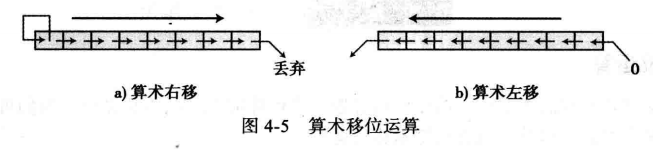

[toc]
# 计算机科学导论读书笔记
## 绪论
### 图灵模型
通用计设备的设想，所有的计算都在一种机器上执行  
  
图灵模型在此基础上添加一个额外的东西，程序，告诉计算机对于数据进行处理的指令集合  
  
所以输出数据依赖于输入数据和程序

### 冯诺依曼模型
通用图灵机都是在存储器中存储数据，冯诺依曼说程序和数据再逻辑上是一致的，所以程序也能存储在计算机的存储器中
#### 4个子系统
1. 存储器：用来存储的区域，用来存储数据和程序
2. 算术逻辑单元：进行计算和逻辑运算的地方
3. 控制单元：对存储器、算术逻辑单元、输入/输出等子系统进行控制操作的单元
4. 输入/输出单元：从外部接受输入和程序以及输出

## 数字系统(进制)
### 转换
#### 其他进制转到10进制
  
其中第二个16进制转10进制并不精确，因为进行了四舍五入，数字转换时需要指明允许保留几位小数。

#### 10进制转其他进制
10进制转其他进制，需要两个过程，1个用于整数，1个用于小数  
1. 转换整数部分  
  
2. 转换小数部分
小数部分转化使用连乘法，十进制的小数位源，转换后的小数部分的数为目标  
  
会存在一直乘不净的问题，所以精度不是最准确的，只能保存多少位

## 数据存储
### 存储数字
1. 存储整数：整数是完整的数字，整数可以被当做小数点位置固定的数字，小数点固定在最右边，**定点表示法**用于存储整数。  
   > 1. 无符号表示法：只包括零和整数的非负整数，它的值是(2^n - 1). 存储无符号整数的步骤：a.将整数变成二进制数，b.如果二进制位数不足n位，则在二进制数的左边补0，使它的总位数为n位，如果位数大于n，该整数无法存储，导致**溢出**。  
   应用：提高存储效率，不必存储整数的符号，所有分配的单元都可以用来存储数字。所以可以用来计数、寻址、存储其他数据类型。  
   > 2. 符号加绝对值表示法：有效范围被分为两个相等的子范围，前半个表示整数，后半个表示负数
     
   在8位存储单元中，可以仅用7位表示数字的绝对值(不带符号)，所以最大的正数值仅是无符号最大数的一半，但是在溢出的情况下，就有正负两种溢出情况，在这种表示法中，有两个0，+0和-0。
   > 3. 二进制补码表示法：几乎所有计算机都使用二进制补码表示法来存储位于n位存储单元中的有符号整数，同样，无符号整数被分为两个相等的子范围，如果n是4，那么该范围是0000到1111，其中分为两半，0000到0111，1000到1111。  补码的运算，方法1：从右边复制位，直到有1被复制，然后翻转其余的位  
     
   方法2：先对它进行1次反码运算再加上1，得到结果。  
   我们在存储整数时，可以采用二进制补码表示法进行存储。并且，二进制补码表示法仅有一个0.  
   二进制补码法也会溢出，比如0111，加1会变成1000,因为是用补码进行表示的，所以这是一个负数，
   用方法1，那么就是遇到第一个1不变,后面全取反，那么还是1000,是无符号里的8，因为是负数，所以就是-8，采用方法
   二来计算，取反1000会变成0111，然后再进行加1，会变成1000,但是这个是无符号的，是8，然后因为最开始补码符号位
   是1，是负数，所以就是-8.  
     

2. 存储实数：实数是带有整数部分和小数部分的数字，如果我们使用固定小数点表示法表示，结果不一定精确，会达不到
   需要的精度。例如小数点左边10个数码，右边2个数码，存储1.00234，那么结果就是1.00，会丢失精度。
   **所以带有很大的整数部分或很小的小数部分的实数不应该用定点表示法存储**  
   
   > 1. 浮点表示法：该表示法允许小数点浮动，可以在小数点左右有不同数量的数码，无论采用什么进制，一个实数都是
   三个部分组成  
     
   第一个部分是符号，可正可负，第二部分显示小数点应该左右移动构成实际数字的位移量，第三部分是小数点位置固定的
   定点表示法。  
     
   **规范化**：科学计数法和浮点表示法都在小数点左边使用唯一的非零数码,只存储一个数的三部分信息：符号、指数、
   尾数(小数点右边的位)。  
   **余码系统**：正的和负的整数可以作为无符号数存储，为了表示正的或者负的整数，一个正整数(偏移量)加到每个数字中，将他们统一移到非负的一边，
   偏移量的值是2^(m-1)-1,m是内存单元存储指数的大小。  
     
   **IEEE标准**：单精度和双精度  
     
   单精度总32位来存储，符号位1位，指数占8位(使用偏移量127)，尾数23(无符号数)，所以也叫余127码，双精度采用64位。  
     
   将存储为IEEE标准浮点数的数字还原：  
   

## 数据运算
### 逻辑运算
1. 非(NOT)：一元操作符，输出位是输入位的相反. 
2. 与(AND)：二元运算符，两个输入，如果输入都是1，则输出为1，其他三种情况，输出都是0.
3. 或(OR)：二元运算符，两个输入，输入都是0，则输出是0，其他三种情况，输出都是1.
4. 异或(XOR)：输入相同，输出是0，输入不同，输出是1. 当第一个输入是1，而输出是第二个输入数的相反。如果第一个输入是0，则输出是第二个数。

### 移位运算
#### 逻辑移位运算
1. 逻辑移位：逻辑右移运算，把每一位向右移动一个位置，最左位补0； 逻辑左移运算是最右位补0.
2. 循环移位：对位进行移位，但没有位被丢弃或者增加，相当于成环了。
#### 算术移位运算
假定是用二进制补码格式表示带符号位的正数，算术右移用来对整数除2；算术左移是对整数乘2，这些运算都不应该改变符号位，
算术右移保留符号位，同时复制符号位的数(0或者1)放入相邻的右边的位中；算术左移丢弃符号位，接收左边的位作为符号位，如果新的符号位与原先相同，那么运算成功，否则发生
上溢或者下溢,结果是非法的。
  

## 计算机组成  
组成部件可以分为三个：中央处理单元(CPU)、主存储器、输入/输出子系统  
1. cpu:算术逻辑单元(ALU)、控制单元、寄存器组。  
   > ALU：对数据进行逻辑、移位和算术运算.  
   > 控制单元：控制单元控制各个子系统的操作，控制是通过控制单元到其他子系统的信号来进行  
   > 寄存器：存放临时数据的高速独立的存储单元.  
   >> 数据存储器：存储输入数据和运算结果.  
   >> 指令寄存器：cpu的职责从内存逐条取出指令，将取出的指令存储在指令寄存器中，解释并执行指令.  
   >> 程序计数器：保存当前正在执行的指令，当前指令执行完后，计数器自动加1，指向下一条指令的内存地址  

2. 主存储器：存储单元的集合，每个存储单元都有一个唯一的标识，叫做地址，数据以字的位组在内存中传入和传出,如果字是8位，叫做1字节.  
   > 地址空间：每个字是通过地址来标识的，所有在存储器中标识的独立的地址单元的总数称为地址空间,一个64kb、字长为1字节的内存地址空间范围是0到65535

## 操作系统
### 定义
操作系统是计算机硬件和用户(程序和人)的一个接口，使得其他程序更加方便有效的运行，能够方便对计算机硬件和软件资源进行访问。  
#### 自举
所以问题来了，操作系统负责把其他程序装入内存中来允许，但是操作系统本身就是程序，它也需要被装入内存。如何解决，使用ROM技术(只读存储器,内容由制造商写入,用户只能读不能写,优点是非易失性,切断电源,数据也不会丢失，通常用来存储那些关机后也不能丢失的程序或数据)把操作系统存储在内存中，cpu的程序计数器可以被设置到这个rom的开始处，当计算机被加电时，cpu从rom中读取指令，执行他们。  
但是这个方案很低效，因为内存的很大一部分需要由内存来构成，而不能被其他程序使用，现在的技术是分配小部分内存给部分操作系统，现在采用两阶段过程。  
1. 很小的一部分内存用rom构成，其中称为**自举**的小程序，计算机被加电时，cpu计数器被设置为自举程序的第一条指令，并执行第一条指令，这个程序的唯一职责就是把操作系统本身(需要启动计算机的那部分)装入RAM内存。
2. 当装入完成后，cpu的程序计数器就被设置为ram中操作系统的第一条指令，操作系统被执行。
  

#### 分时系统
目的是为了有效的使用计算机资源，将多个作业同时装入内存，并且仅当该资源可用时分配给它的作业. 每个作业可以被分到一段时间来使用资源，但是这样需要一个更加复杂的操作系统，来进行**调度**,同时也产生了一个术语:**进程**，一个作业是一个要运行的程序，一个进程则是在内存中等待分配资源的程序。  

#### 并行系统
出现原因：人们对更快和更有效的需求导致出现这个设计，在同一个系统中安装多个cpu，每个cpu可以处理一个程序或程序的一部分。多任务可以并行的处理而不是串行处理，所以这种操作系统比单cpu的系统复杂的多。  

### 组成部分
  
1. 用户界面：用来接收用户(进程)的输入并向操作系统解释这些请求的程序。比如unix的用户界面被称为**命令解释程序**(shell)，在其他系统中，则称为窗口
2. 内存管理器：
   > 单道程序：虽然是过去的东西嘞,但是学习下思想。 大多数内存用来装载单一的程序，仅仅一小部分用来装载操作系统，整个程序装入内存运行，运行结束后，程序区域由其他程序取代。 但是这有问题：a.如果内存比程序小，那么就没法装程序。 b.当一个程序在运行时，其他程序不能运行，但是一个程序在运行中经常要输入/输出，但是输入/输出设备速度远远小于cpu，所以cpu处于空闲状态，但是现在内存中没有其他程序，cpu不能为其他程序服务，所以这种情况cpu和内存的使用效率很低.  
   > 多道程序：同一时刻可以装入多个程序并且能够同时被执行，cpu轮流为其服务。
   >> 分区调度：内存被分为不定长的几个分区，每个部分或分区保存一个程序。cpu在各个程序之间交替服务。直到该程序有io操作或者分配的时间到达为止。cpu保存最近使用的指令所分配的内存地址后转入下一个程序。cpu可以进行优先级管理，用于控制分配给每个程序的cpu时间。但是还是有些问题，a.分区的大小必须由内存管理器预先决定，b.随着新程序的交换载入内存后可能会出现空闲区，c.空闲区过多，内存管理器可以紧缩分区并删除空闲区和创建新区，将增加系统的额外开销。  
   >> 分页调度：内存被分为大小相同的若干个部分，叫做帧，程序被分为大小相等的部分，叫做页. 页被载入到帧中。 如果一个程序有3个页，那么就必须要3个帧，这样程序在内存中可以不是连续的。但是这种还是有个弊端，就是必须还是要有6个帧。  
   >> 请求分段调度：程序将按程序猿的角度划分为段，然后载入内存中，可以被来自同一程序或者其他程序的模块替代。  

3. 进程管理器：
术语：a.**程序**：程序猿编写的一组稳定的指令，存在磁盘上,它可能会也可能不会成为作业。 b.**作业**：从一个程序被选中执行，到它结束并再次成为程序的过程中，该程序叫做作业。每个作业都是程序，但是程序不一定是作业。 c.**进程**：是一个运行中的程序，该程序开始运行还未结束，只要作业装入内存就是一个进程。
   
