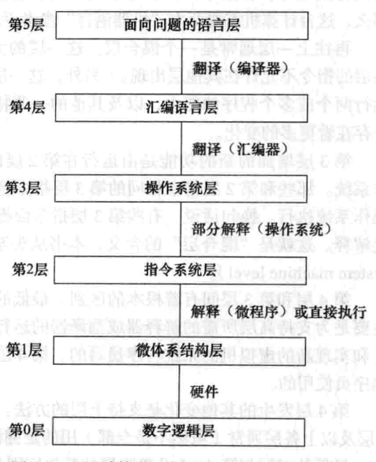
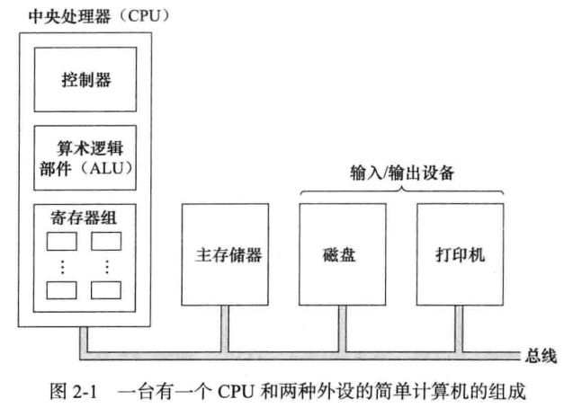
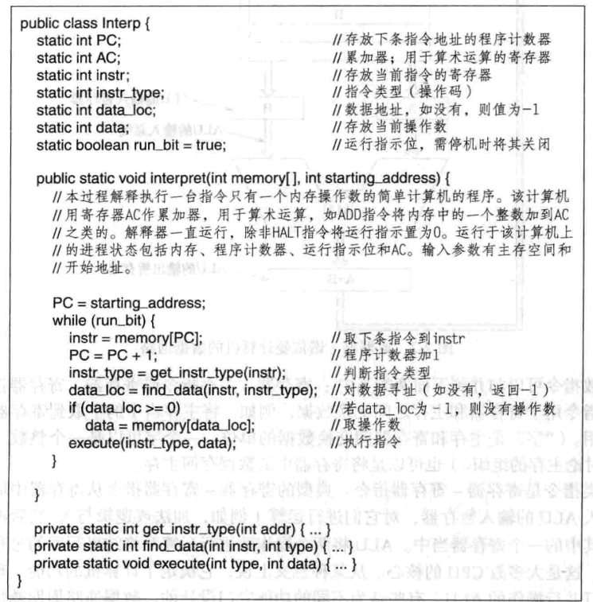
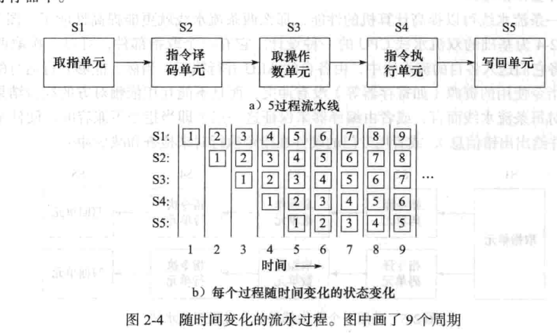
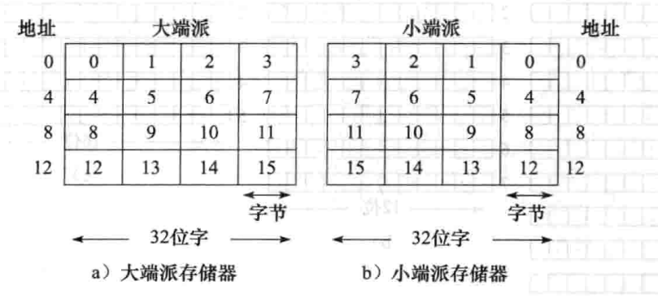
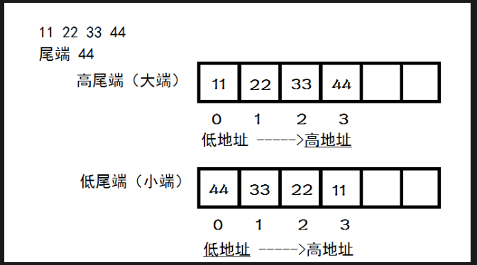

[toc]
# 计算机组成

## 概述
### 现代多层次计算机
  
其实第0层下面还有一层，设备层，属于电子工程领域的。  
1. 数字逻辑层，感兴趣的对象是**门**，每个门有一个或者多个数字输入端(0/1表示的信号)，可计算并输出这些输入的一些简单逻辑函数的结果，门最多由几个晶体管构成，
几个门可以组成1位存储器，存放一个0或者1，1位存储器可以组合成16、32、64一组，形成寄存器。
2. 微体系结构层，由8到32个寄存器组成的寄存器组以及ALU的电路，寄存器和ALU相连形成数据通路，数据在其中流动。这可以看成第二层指令的解释器，对数据通路逐条对指令进行取值、检查和执行。
3. 指令系统层，每个计算机制造商会为出售的计算机出版一本手册，叫机器语言参考手册，这些指令集，实际上由微程序解释或硬件执行电路直接执行的指令。
4. 混合层，大多数指令和 指令系统层相同，当然还有新的指令集，这层增加的新功能由运行在指令系统层的解释器来执行。
5. 汇编语言层，低层语言的符号表示，用汇编语言写的程序首先被翻译成第1，2，3层的语言，然后由响应的虚拟机或者硬件解释执行，完成翻译过程的程序叫汇编器。
6. 面向问题的语言层，高级语言，提供给解决现实问题的应用程序猿使用，一般先由编译器翻译成第三层或者第四层语言。  

早期计算机中，硬件和软件之间的界限十分清楚，但是随着计算机层次的增加、减少和合并，界限变得越来越模糊，事实上：  ***硬件和软件在逻辑上是等同的***  

## 计算机系统组成  
  
### 处理器
处理器：控制器从主存储器取指令和分析指令类型；算术逻辑部件通过完成加法、逻辑与等来执行指令；寄存器组用来存放中间结果和一些控制信息。  
指令可以归为两类： 1. 寄存器-主存指令(寄存器和主存之间交换数据)。 2.寄存器-寄存器指令。  
指令执行的步骤：  
* 从主存中取下一条指令到指令寄存器。
* 将程序计数器指向后面的一条指令。
* 判断刚刚取得的指令的类型。
* 如果该指令用到主存单元，则对主存进行寻址。
* 如果需要，从主存取一个字到cpu的寄存器中。
* 执行指令。
* 返回第一步准备执行下一条指令。

这个过程，可以叫做取指-译码-执行。 可以用java代码描述。  
  
**说明程序并不一定需要一大堆电子器件组成的硬件cpu来执行**，可以由另一个程序通过取指令、分析指令和执行指令的过程来执行一个程序的指令，这就是解释器。使用解释器的好处：a.解释过程中改正指令实现中的错误，甚至补偿基础硬件中的设计缺陷。 b.最小的代价增加新的指令。 c.对复杂指令方便的进行升级。  

### 现代计算机设计原则
1. 所有指令由硬件直接执行，不要再由微指令解释一遍，减少一层解释提高大多数指令的执行速度。
2. 最大限度提高指令启动速度，主要就是每秒钟内启动尽量多的指令，而不必计较这些指令实际上用了多少时间执行完。
3. 指令应该容易译码，应该采用手段来加速指令的译码，包括让指令规整、固定指令的长度、指令中的字段数要少一些，指令格式越少越好。
4. 只允许读写主存指令访问主存。因为访问主存需要花费较长的时间，所以最好让他们和其他指令重叠执行，所以最好只有LOAD和STORE指令可以访问主存，所有其他的指令操作数应只在寄存器中。
5. 提供足够的寄存器。

### 并行
为啥需要并行，因为需要好提高计算机性能，通过提高芯片的主频让它更快是一个方法，但是基本这条路在当时材料的情况下已经到头了。所以很多设计者就把并行处理当做另一个方法。  
#### 指令级并行
指令流水：因为从主存中取指令是阻碍速度的主要瓶颈。所以想到了**缓存**，将指令从主存中预取出来，存放在一组**预取缓冲**的寄存器中。预取把指令执行分解成了两个部分：取指令和执行指令，指令流水就相当于流水线。  
  
比如第一条指令流水线到了s2,这时候又来一个指令，这时候可以并行执行取指单元。  

#### 处理器级并行
其实就是多个cpu，多核。  

### 主存储器

#### 字节顺序
字节地址从左到右排还是从右往左排。分为大端派和小端派  
  
实际上大端和小端不容易理解，可以翻译为高尾端，低尾端。  
  
尾端是44，放在后面，那就是高地址， 高尾端。 放在前面就是低地址，低尾端。  

#### 纠错码
出现的原因：电源线的尖峰电压或者其他原因，计算机主存偶尔会出错，所以需要纠错码，加上附加位，当从主存中读出一个字，用这些附加位来检验主存是否出错。  
若海明码长为n，信息位为k，则需要插入r个校验码，TODO  

