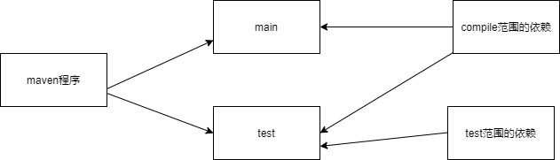

[TOC]
# maven
## maven是什么
* maven是java平台的自动化构建工具，构建工具的历史是make->ant->maven->gradle
* 构建的定义
  >以java源文件、框架配置文件、jsp、-html、图片等资源为原材料，去生产一个可以运行的项目的过程。(编译、部署、搭建)  
  > 编译：java源文件->编译->class字节码文件->交给jvm执行  
  > 部署：bs项目最终运行的并不是动态web工程本身，而是动态web工程 编译的结果

## 没有maven前的困难  
* 项目中的jar包必须手动 复制、粘贴到web-inf/lib目录下，可能同样的jar包文件重复出现在不同的项目工程中，浪费空间，让工程臃肿
* 我们需要自己准备jar包
* 一个jar包依赖的其他jar包需要手动加入到项目中
* 项目非常庞大的情况下，不适合使用package划分模块，最好是每一个模块对应一个工程，利于分工协作

## maven作用
* maven可以将jar包保存在仓库中，有需要使用的工程引用这个文件接口，并不需要真的把jar包复制过来
* maven能够自动下载jar包，并且下载的是正版的哦，因为jar包按照统一的规范存放在maven的中央仓库
* maven能够自动引入其他的jar包，不用程序猿知道jar包之间的依赖关系
* maven可以将一个项目拆分成多个工程

## maven 构建的环节
1. 清理 ：将以前编译得到的旧的class字节码文件删除，为下一次编译做准备
2. 编译 ：将java源程序编译成class字节码文件
3. 测试 ：自动测试，自动调用junit程序
4. 报告 ：测试程序执行的结果
5. 打包 ：动态web工程打war包，java工程打jar包
6. 安装 ：maven特定的概念，将打包得到的文件复制到仓库中的指定位置
7. 部署 ：将动态web工程生成的war包复制到servlet容器的指定目录下，使其可以运行

## 安装maven
1. 查看是否安装了java环境
2. 下载maven，解压
3. 配置maven环境变量，配置maven_home ，然后将bin配置到path下
4. 输入mvn -v 验证

## 核心概念
### 约定的目录结构
根目录：工程名；src目录：源码；main：存放主目录；test：存放测试程序；java目录：存放java源文件；resources：存放框架或其他工具的配置文件  
maven核心程序先到本地仓库查找，找不到才会去中央仓库下载。默认的本地仓库可以在conf/settings.xml里修改，<localRepository>,修改为已经准备好的仓库目录
### pom  
pom：project object model 项目对象模型，就和DOM document object model一样。  
pom.xml是maven的核心配置文件，与构建过程相关的都在这儿进行配置。  

### 坐标
使用三个向量在仓库中唯一定位一个maven工程  
1. groupid ：公司或者组织域名倒序+项目名
2. artifactid：模块名
3. version：版本
### 依赖
对于自己开发的maven工程，使用install命令安装后就可以进入本地仓库
#### 依赖的范围
  
1. complie
  > 对主程序是否有效：有效  
  > 对测试程序是否有效：有效  
  > 是否参与打包：参与
2. test
  > 对主程序是否有效：无效  
  > 对测试程序是否有效：有效  
  > 是否参与打包：不参与  
3. provided：假如maven工程分为3个阶段(开发、部署、运行)，compile在这个三个阶段都要有，test仅在开发阶段有，而provided在开发阶段才有，
因为比如servlet-api包，在tomcat服务器中是有的，所以在部署阶段忽略，由服务器提供，
  > 对主程序是否有效：有效  
  > 对测试程序是否有效：有效  
  > 是否参与打包：不参与  
#### 依赖的传递性
好处： 可以传递的依赖不必在每个模块工程中都重复声明，在最下面的工程依赖一次就行。  
注意：非compile范围的依赖不能传递
#### 依赖的排除
当我们引入某包，但是因为依赖的传递性，它也自动引入日志包，但是我们自己引入了，为了避免冲突，则需要将该日志包排除，使用\<exclusion>
#### 依赖的原则
1. 最短路径

因为1.24离它近，所以其实是选择1.24的  
2. 路径相同时，先声明的优先

#### 统一管理依赖的版本
使用properties标签内使用自定义标签统一声明版本号
### 仓库
#### 仓库分类
1. 本地仓库：当前电脑上部署的仓库目录
2. 远程仓库：
   > 私服，架设在当前局域网环境下，为当前局域网范围内的所有maven工程服务  
   > 中央仓库，架设在internet上，为全世界所有maven工程服务  
   > 中央仓库镜像，为分担中央仓库的流量，提升用户访问速度
#### 仓库中保存的内容
1. maven自身需要的插件
2. 第三方框架或工具的jar包
3. 自己开发的maven工程
### 生命周期/插件/目标
1. 各个构建环节执行的顺序：不能打乱顺序，必须按照正确的顺序执行
2. maven的核心程序定义了抽象的生命周期，生命周期中各个阶段的具体任务是由插件来完成的
3. 为了更好的实现自动化构建，按照这一个特点来执行：不论现在是执行哪个阶段，都是从生命周期最开始的阶段开始
### 继承
A依赖的junit是4.0,B依赖的junit是4.9，所以需要统一管理各个模块工程对于junit的依赖，但是因为junit是test范围的，不能够依赖传递，所以分散在各个模块中，容易造成不一致。  
解决方法：将junit依赖统一提到父工程中，在子工程声明junit依赖时不指定版本，以父工程中的为准，同时也便于修改。  
操作步骤：
1. 创建一个maven工程作为父工程，打包方式为pom
2. 在子工程声明对父工程的引用
3. 将子工程的坐标中与父工程坐标中重复的内容删除
4. 在父工程中统一junit的依赖，/<denpendencyManagement>
5. 在子工程中删除junit依赖的版本号部分
### 聚合
作用：一键安装各个模块工程，就不用我们挨着每个模块去install了  
配置方式： 在一个"总的聚合工程"中配置各个参与聚合的模块/<modules>，指定各个子工程的相对路径  
使用方式：在聚合工程的pom.xml上maven install

### build详解
配置当前工程构建过程中的特殊设置/<build>，然后配置构建过程中需要的插件/<plugins>